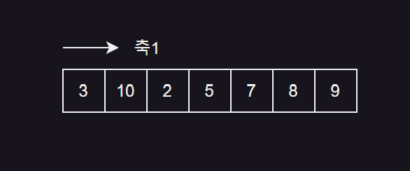
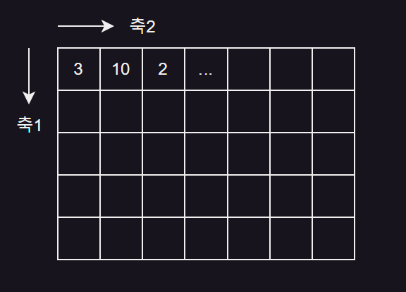
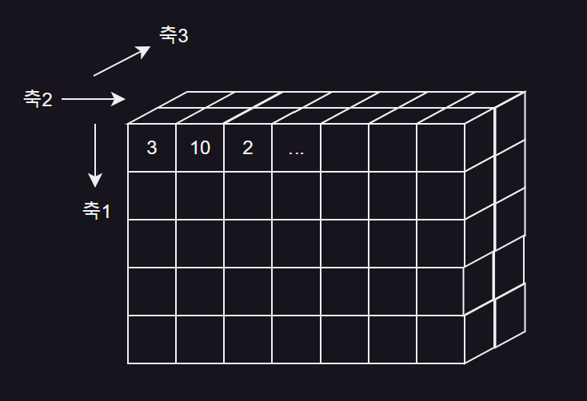
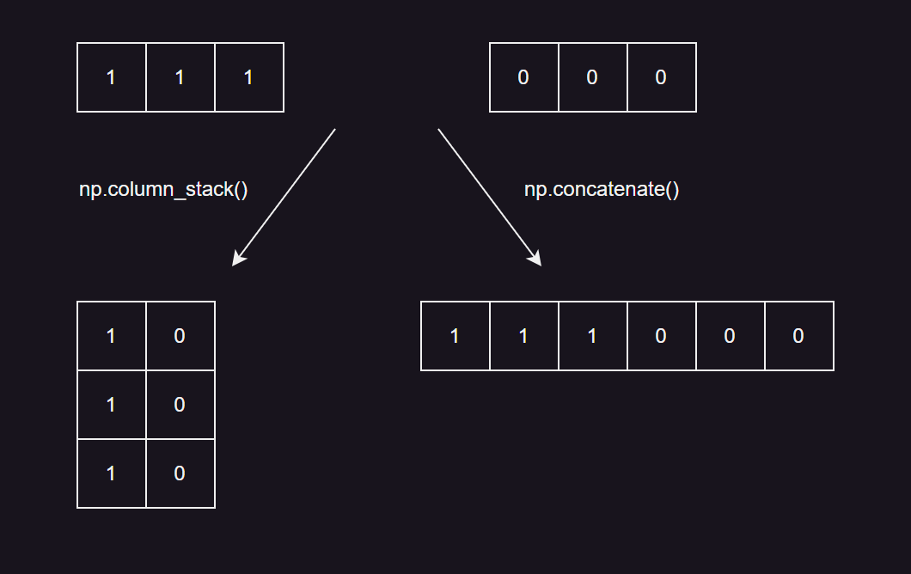

# 데이터 다루기
[01] 훈련 세트와 테스트 세트
---
### 01. 지도 학습과 비지도 학습
#### 지도 학습(supervised learning)
- 지도 학습 알고리즘 : 훈련하기 위한 데이터와 정답 필요

  - ex. k-최근접 이웃 알고리즘

  - **훈련 데이터**(training data) = **입력**(input, 데이터) + **타깃**(target, 정답)
 
- 정답(타깃)이 있으니 알고리즘이 정답을 맞히는 것을 학습

  - ex. 도미인지 빙어인지 구분

<br>

#### 비지도 학습(unsupervised learning)
- 비지도 학습 알고리즘 : 타깃 없이 입력 데이터만 사용

- 정답을 사용하지 않으므로 무언가를 맞힐 수 없음

- 데이터 파악 또는 변형에 도움

<br>

#### 강화 학습(reinforcement learning)
- 강화 학습 알고리즘 : 타깃이 아니라 알고리즘이 행동한 결과로 얻은 보상을 사용해 학습됨

<br>

### 02. 훈련 세트와 테스트 세트
- 머신러닝 알고르짐의 성능을 제대로 평가하려면 훈련 데이터와 평가에 사용할 데이터가 각각 달라야 함

  - 평가를 위해 또 다른 데이터를 준비
 
  - 이미 준비된 데이터 중에서 일부를 떼어 내어 활용 (일반적으로 많이 사용)
 
<BR>

#### 테스트 세트(test set)
- 평가에 사용하는 데이터

<br>

#### 훈련 세트(train set)
- 훈련에 사용되는 데이터

<br>

> 도미와 빙어의 데이터를 합쳐 하나의 파이썬 리스트로 준비
```python
  fish_length = [25.4, 26.3, 26.5, 29.0, 29.0, 29.7, 29.7, 30.0, 30.0, 30.7, 
                  31.0, 31.0, 31.5, 32.0, 32.0, 32.0, 33.0, 33.0, 33.5, 33.5,
                  34.0, 34.0, 34.5, 35.0, 35.0, 35.0, 35.0, 36.0, 36.0, 37.0,
                  38.5, 38.5, 39.5, 41.0, 41.0, 9.8, 10.5, 10.6, 11.0, 11.2, 
                  11.3, 11.8, 11.8, 12.0, 12.2, 12.4, 13.0, 14.3, 15.0]
  fish_weight = [242.0, 290.0, 340.0, 363.0, 430.0, 450.0, 500.0, 390.0,
                  450.0, 500.0, 475.0, 500.0, 500.0, 340.0, 600.0, 600.0,
                  700.0, 700.0, 610.0, 650.0, 575.0, 685.0, 620.0, 680.0,
                  700.0, 725.0, 720.0, 714.0, 850.0, 1000.0, 920.0, 955.0,
                  925.0, 975.0, 950.0, 6.7, 7.5, 7.0, 9.7, 9.8, 8.7, 10.0, 
                  9.9, 9.8, 12.2, 13.4, 12.2, 19.7, 19.9]
```

> 두 파이썬 리스트를 순회하면서 각 생선의 길이와 무게를 하나의 리스트로 담은 2차원 리스트 생성
```python
  fish_data = [[l, w] for l, w in zip(fish_length, fish_weight)]
  fish_target = [1] * 35 + [0] * 14
```
- 하나의 생선 데이터를 **샘플**이라 부름

  - 도미와 빙어는 각각 35마리, 14마리가 있으므로 전체 데이터는 49개의 샘플로 이루어져 있음
 
- 사용하는 특성은 2개 (길이, 무게)

<br>

<details>
  <summary>💡 인덱스 지정 및 슬라이싱</summary>

<br>

> 코드
```python
  # 인덱스 지정
  print(fish_data[4], '\n')
  
  # 슬라이싱
  print(fish_data[0:5])
  print(fish_data[:5])
  print(fish_data[44:49])
  print(fish_data[44:])
```
- 리스트처럼 배열의 요소를 선택할 때는 배열의 위치(**인덱스**, index) 지정

  - 배열의 인덱스는 0부터 시작 → 다섯 번째 샘플의 인덱스 = 4
 
- **슬라이싱**(slicing) : 콜론(:)을 가운데 두고 인덱스의 범위를 지정하여 여러 개의 원소 선택 가능

  - **마지막 인덱스의 원소는 포함되지 않는다**는 점 주의
 
    - ex. '0:5' ⇒ 0~4 까지의 5개 원소만 선택되고 인덱스 5인 여섯 번째 원소는 선택 X
   
      - 처음부터 시작되는 슬라이싱의 경우 0 생략 가능
     
    - ex. '44:49' ⇒ '44:' 로 사용 가능
     
      - 마지막 원소까지 포함할 경우 두 번재 인덱스 생략 가능

<br>

> 결과
```python
  [29.0, 430.0] 
  
  [[25.4, 242.0], [26.3, 290.0], [26.5, 340.0], [29.0, 363.0], [29.0, 430.0]]
  [[25.4, 242.0], [26.3, 290.0], [26.5, 340.0], [29.0, 363.0], [29.0, 430.0]]
  [[12.2, 12.2], [12.4, 13.4], [13.0, 12.2], [14.3, 19.7], [15.0, 19.9]]
  [[12.2, 12.2], [12.4, 13.4], [13.0, 12.2], [14.3, 19.7], [15.0, 19.9]]
```

</details>

<br>

> 처음 35개를 훈련 세트로, 나머지 14개를 테스트 세트로 사용
```python
  from sklearn.neighbors import KNeighborsClassifier
  kn = KNeighborsClassifier()
  
  # 훈련 세트로 입력값 중 0부터 34번째 인덱스까지 사용
  train_input = fish_data[:35]
  # 훈련 세트로 타깃값 중 0부터 34번째 인덱스까지 사용
  train_target = fish_target[:35]
  # 테스트 세트로 입력값 중 35번째부터 마지막 인덱스까지 사용
  test_input = fish_data[35:]
  # 테스트 세트로 타깃값 중 35번째부터 마지막 인덱스까지 사용
  test_target = fish_target[35:]
  
  kn.fit(train_input, train_target)
  kn.score(test_input, test_target)
```
-  슬라이싱 연산으로 인덱스 0\~34 까지 처음 35개 샘플을 훈련 세트로 선택, 인덱스 35\~48 까지 나머지 14개 샘플을 테스트 세트로 선택

-  데이터 준비 후 훈련 세트로 fit() 메서드를 호출해 모델 훈련 후 테스트 세트로, score() 메서트를 호출해 평가

> 결과
```python
  0.0
```
- 최악의 성능 why?

  - fish_data 에 순서대로 35개의 도미와 14개의 빙어 샘플이 들어있음
 
    - 마지막 14개를 테스트 세트로 만들면 빙어 데이터만 들어감
   
    - 훈련 세트에는 도미만 있기 때문에 테스트 세트가 무엇이든 무조건 도미라고 분류하므로 정답 맞히지 못함
   
- 훈련 데이터와 테스트 데이터에는 도미와 빙어가 골고루 섞여 있어야 함

<br>

### 03. 샘플링 편향(sampling bias)
- 훈련 세트와 테스트 세트에 샘플이 골고루 섞여 있지 않으면 샘플링이 한쪽으로 치우친 상태

- 특정 종류의 샘플이 과도하게 많은 샘플링 편향을 가지고 있다면 제대로 된 지도 학습 모델을 만들 수 없음

<br>

### 04. 넘파이(numpy)
- 파이썬의 대표적인 배열(array) 라이브러리

- 고차원의 배열을 손쉽게 만들고 조작할 수 있는 간편한 도구 많이 제공

  - 파이썬의 리스트로 2차원 리스트는 표현 가능하지만 고차원 리스트 표현은 번거로움

  - 차원(dimension)이란 말은 조금씩 다른 의미로 쓰일 수 있으나 배열에서 차원은 좌표계의 축과 같음

|1차원 배열|2차원 배열|3차원 배열|
|:-:|:-:|:-:|
||||
|선|면|공간|

- 배열의 시작점이 왼쪽 위에서부터 시작함

<br>

> 생선 데이터를 2차원 넘파이 배열로 변환
```python
  import numpy as np
  
  input_arr = np.array(fish_data)
  target_arr = np.array(fish_target)
  
  print(input_arr)
  print(input_arr.shape)  # (샘플 수, 특성 수) 출력
```
- 파이썬 리스트를 넘파이 배열로 바꾸는 방법

  - 넘파이 array() 함수에 파이썬 리스트를 전달
 
- shape 속성 : 배열의 크기 확인

> 결과
```python
  [[  25.4  242. ]
   [  26.3  290. ]
    ...
   [  15.    19.9]]
  (49, 2)
```
- 넘파이는 배열의 차원을 구분하기 쉽도록 행과 열을 가지런히 출력

  - 49개의 행과 2개의 열 확인 가능
 
<br>

> 랜덤으로 샘플 선택
```python
  np.random.seed(42)
  index = np.arange(49)
  np.random.shuffle(index)
  
  print(index)
```
- 배열을 섞은 후에 나누는 방식 대신 무작위로 샘플을 고르는 방법 사용

  - input_arr 와 target_arr 에서 같은 위치는 함께 선택되어야 함
 
- 인덱스를 섞은 다음 input_arr 와 target_arr 에서 샘플을 선택하면 무작위로 훈련 세트를 나누는 셈

- 넘파이 arange() 함수 사용하면 0에서부터 48까지 1씩 증가하는 인덱스 생성 가능

  - 정수 N 을 전달하면 0에서부터 N-1 까지 1씩 증가하는 배열을 만듦
 
    - 넘파이 random 패키지 아래에 있는 shuffle() 함수는 주어진 배열을 무작위로 섞음

> 결과
```python
  [13 45 47 44 17 27 26 25 31 19 12  4 34  8  3  6 40 41 46 15  9 16 24 33
   30  0 43 32  5 29 11 36  1 21  2 37 35 23 39 10 22 18 48 20  7 42 14 28
   38]
```

<br>

> 배열 인덱싱
```python
  print(input_arr[[1, 3]])
```
- input_arr 에서 두 번째와 네 번째 샘플을 선택하여 출력

> 결과
```python
  [[ 26.3 290. ]
   [ 29.  363. ]]
```
- 넘파이는 슬라이싱 외에 **배열 인덱싱**(array indexing) 기능 제공

  - 배열 인덱싱은 1개의 인덱스가 아닌 여러 개의 인덱스로 한 번에 여러 개의 원소 선택 가능

<br>

> 리스트 대신 넘파이 배열을 인데스로 전달
```python
  train_input = input_arr[index[:35]]
  train_target = target_arr[index[:35]]
  
  print(input_arr[13], train_input[0])
```
- index 배열의 처음 35개를 input_arr 와 target_arr 에 전달하여 랜덤하게 35개의 샘플을 훈련 세트로 만들기

> 결과
```python
  [ 32. 340.] [ 32. 340.]
```
- 만들어진 index 의 첫 번째 값은 13

  - train_input 의 첫 번째 원소는 input_arr 의 열네 번째 원소가 들어있을 것

<br>

> 나머지 14개를 테스트 세트로 만들기
```python
  test_input = input_arr[index[35:]]
  test_target = target_arr[index[35:]]
```

<br>

> 훈련 세트와 테스트 세트에 도미와 방어가 잘 섞여 있는지 산점도로 확인
```python
  import matplotlib.pyplot as plt
  plt.scatter(train_input[:, 0], train_input[:, 1])
  plt.scatter(test_input[:, 0], test_input[:, 1])
  plt.xlabel('length')
  plt.ylabel('weight')
  plt.show()
```
- 2차원 배열은 행과 열 인덱스를 콤마(,)로 나누어 지정

  - 슬라이싱 연산자로 처음부터 마지막 원소까지 모두 선택하는 경우 시작과 종료 인덱스를 모두 생략 가능
 
> 결과


- 파란색 : 훈련 세트, 주황색 : 테스트 세트

  - 양쪽에 도미와 빙어가 모두 섞여 있음

<br>

#### 💡 넘파이에서 무작위 결과를 만드는 함수들은 실행할 때마다 다른 결과를 만듦
- 일정한 결과를 얻으려면 초기에 랜덤시드(random seed) 지정

<br>

### 05. 두 번째 머신러닝 프로그램
- 앞서 만든 훈련 세트와 테스트 세트로 k-최근접 이웃 모델 훈련

- fit() 메서드 실행할 때마다 KNeighborsClassifier 클래스의 객체는 이전에 학습한 모든 것을 잃어버림

  - 이전 모델을 그대로 두고 싶다면 KNeighborsClassifier 클래스 객체 새로 생성

> 훈련
```python
  kn.fit(train_input, train_target)
  
  # 인덱스를 섞어 만든 train_input 과 train_target 으로 모델 훈련
  kn.score(test_input, test_target)
```

> 결과
```python
  1.0
```
- 100% 정확도로 테스트 세트에 있는 모든 생성 맞힘

<br>

> 예측
```python
  print(kn.predict(test_input))
  print(test_target)
```
- predict() 메서드로 테스트 세트의 예측 결과와 실제 타깃 확인

> 결과
```python
  [0 0 1 0 1 1 1 0 1 1 0 1 1 0]
  [0 0 1 0 1 1 1 0 1 1 0 1 1 0]
```
- predict() 메서드가 반환하는 값은 단순한 파이썬 리스트가 아니라 넘파이 배열

  - print 없이 출력시 array() 로 감싸여 있음
 
  - 사이킷런 모델의 입력과 출력은 모두 넘파이 배열
 
    - 넘파이는 많은 파이썬 과학 라이브러리에서 사용하는 표준 데이터

<br>

> 전체 코드
```python
fish_length = [25.4, 26.3, 26.5, 29.0, 29.0, 29.7, 29.7, 30.0, 30.0, 30.7, 
                31.0, 31.0, 31.5, 32.0, 32.0, 32.0, 33.0, 33.0, 33.5, 33.5,
                34.0, 34.0, 34.5, 35.0, 35.0, 35.0, 35.0, 36.0, 36.0, 37.0,
                38.5, 38.5, 39.5, 41.0, 41.0, 9.8, 10.5, 10.6, 11.0, 11.2, 
                11.3, 11.8, 11.8, 12.0, 12.2, 12.4, 13.0, 14.3, 15.0]
fish_weight = [242.0, 290.0, 340.0, 363.0, 430.0, 450.0, 500.0, 390.0,
                450.0, 500.0, 475.0, 500.0, 500.0, 340.0, 600.0, 600.0,
                700.0, 700.0, 610.0, 650.0, 575.0, 685.0, 620.0, 680.0,
                700.0, 725.0, 720.0, 714.0, 850.0, 1000.0, 920.0, 955.0,
                925.0, 975.0, 950.0, 6.7, 7.5, 7.0, 9.7, 9.8, 8.7, 10.0, 
                9.9, 9.8, 12.2, 13.4, 12.2, 19.7, 19.9]

fish_data = [[l, w] for l, w in zip(fish_length, fish_weight)]
fish_target = [1] * 35 + [0] * 14

from sklearn.neighbors import KNeighborsClassifier
kn = KNeighborsClassifier()

# 훈련 세트로 입력값 중 0부터 34번째 인덱스까지 사용
train_input = fish_data[:35]
# 훈련 세트로 타깃값 중 0부터 34번째 인덱스까지 사용
train_target = fish_target[:35]
# 테스트 세트로 입력값 중 35번째부터 마지막 인덱스까지 사용
test_input = fish_data[35:]
# 테스트 세트로 타깃값 중 35번째부터 마지막 인덱스까지 사용
test_target = fish_target[35:]

kn.fit(train_input, train_target)
kn.score(test_input, test_target)

# 넘파이
import numpy as np

input_arr = np.array(fish_data)
target_arr = np.array(fish_target)

print(input_arr)
print(input_arr.shape)  # (샘플 수, 특성 수) 출력

np.random.seed(42)
index = np.arange(49)
np.random.shuffle(index)

print(index)

print(input_arr[[1, 3]])

train_input = input_arr[index[:35]]
train_target = target_arr[index[:35]]

print(input_arr[13], train_input[0])

test_input = input_arr[index[35:]]
test_target = target_arr[index[35:]]

import matplotlib.pyplot as plt
plt.scatter(train_input[:, 0], train_input[:, 1])
plt.scatter(test_input[:, 0], test_input[:, 1])
plt.xlabel('length')
plt.ylabel('weight')
plt.show()

# 머신러닝 프로그램
kn.fit(train_input, train_target)

kn.score(test_input, test_target)

print(kn.predict(test_input))
print(test_target)
```

<br>  

---

<br>

🚨 핵심 정리
---
- **지도 학습** : 입력과 타깃을 전달하여 모델을 훈련한 다음 새로운 데이터를 예측하는 데 활용

  - k-최근접 이웃이 지도 학습 알고리즘
 
- **비지도 학습** : 타깃 데이터 없음

  - 무엇을 예측하는 것이 아니라 입력 데이터에서 어떤 특징을 찾는 데 주로 활용
 
- **훈련 세트** : 모델을 훈련할 때 사용하는 데이터

  - 보통 훈련 세트가 클수록 좋음
 
  - 테스트 세트를 제외한 모든 데이터를 사용
 
- **테스트 세트** : 전체 데이터에서 20~30%를 테스트 세트로 사용하는 경우가 많음

  - 전체 데이터가 아주 크다면 1%만 덜어내도 충분할 수 있음
 
- **numpy**

  - **seed()** : 넘파이에서 난수를 생성하기 위한 정수 초기값 지정
 
    - 초기값이 같으면 동일한 난수 뽑을 수 있음
   
    - 랜덤 함수의 결과를 동일하게 재현하고 싶을 때 사용
   
  - **arange()** : 일정한 간격의 정수 또는 실수 배열 생성
 
    - 기본 간격은 1
   
    - 매개변수가 하나이면 종료 숫자 의미
   
    - 0에서 종료 숫자까지 배열 생성
   
    - 종료 숫자는 배열에 포함되지 않음
   
    - 매개변수가 2개면 시작 숫자, 종료 숫자 의미
   
    - 매개변수가 3개면 마지막 매개변수가 간격을 나타냄
   
  - **shuffle()** : 주어진 배열을 랜덤하게 섞음
 
    - 다차원 배열일 경우 첫 번째 축(행)에 대해서만 섞음

> ex
```python
  print(np.arange(3))
  print(np.arange(1, 3))
  print(np.arange(1, 3, 0.2))
  
  arr = np.array([[1, 2], [3, 4], [5, 6]])
  np.random.shuffle(arr)
  print(arr)
```

> 결과
```python
  [0 1 2]
  [1 2]
  [1.  1.2 1.4 1.6 1.8 2.  2.2 2.4 2.6 2.8]
  
  [[5 6]
   [1 2]
   [3 4]]
```

<br>  

---

<br>

[2] 데이터 전처리
---
### 01. 넘파이로 데이터 준비
> 생선 데이터
```python
  fish_length = [25.4, 26.3, 26.5, 29.0, 29.0, 29.7, 29.7, 30.0, 30.0, 30.7, 
                  31.0, 31.0, 31.5, 32.0, 32.0, 32.0, 33.0, 33.0, 33.5, 33.5,
                  34.0, 34.0, 34.5, 35.0, 35.0, 35.0, 35.0, 36.0, 36.0, 37.0,
                  38.5, 38.5, 39.5, 41.0, 41.0, 9.8, 10.5, 10.6, 11.0, 11.2, 
                  11.3, 11.8, 11.8, 12.0, 12.2, 12.4, 13.0, 14.3, 15.0]
  fish_weight = [242.0, 290.0, 340.0, 363.0, 430.0, 450.0, 500.0, 390.0,
                  450.0, 500.0, 475.0, 500.0, 500.0, 340.0, 600.0, 600.0,
                  700.0, 700.0, 610.0, 650.0, 575.0, 685.0, 620.0, 680.0,
                  700.0, 725.0, 720.0, 714.0, 850.0, 1000.0, 920.0, 955.0,
                  925.0, 975.0, 950.0, 6.7, 7.5, 7.0, 9.7, 9.8, 8.7, 10.0, 
                  9.9, 9.8, 12.2, 13.4, 12.2, 19.7, 19.9]
```
- 이전에는 파이선 리스트를 순회하면서 원소를 하나씩 꺼내 리스트 안의 리스트로 직접 구성

<br>

> 넘파이 생성 예제
```python
  import numpy as np
  np.column_stack(([1,2,3],[4,5,6]))
```
- column_stack() 함수 : 전달받은 리스트를 일렬로 세운 다음 차례대로 나란히 연결

> 결과
```python
  array([[1, 4],
         [2, 5],
         [3, 6]])
```
- 만들어진 배열은 (3, 2) 크기의 배열 ⇒ 3개의 행, 2개의 열

<br>

> fish_length 와 fish_weight 합치기
```python
  fish_data = np.column_stack((fish_length, fish_weight))
  print(fish_data[:5])
```

> 결과
```python
  [[ 25.4 242. ]
   [ 26.3 290. ]
   [ 26.5 340. ]
   [ 29.  363. ]
   [ 29.  430. ]]
```
- 넘파이 배열 출력시 리스트처럼 한 줄로 길게 출력되지 않고 행과 열을 맞춰 정리된 모습으로 보임

<br>

#### 💡 튜플(tuple)
- 파이썬 튜플은 리스트와 매우 비슷함

- 리스트처럼 원소에 순서가 있지만 한 번 만들어진 튜플은 수정 불가

- 튜플을 사용하면 함수로 전달한 값이 바뀌지 않는다는 것을 믿을 수 있음

  - 매개변수 값으로 많이 사용

<br>

> 타깃 데이터 생성
```python
  fish_target = np.concatenate((np.ones(35), np.zeros(14)))
  print(fish_target)
```
- np.ones(), np.zeros() : 각각 원하는 개수의 1과 0을 채운 배열 생성해줌

- np.concatenate() : 첫 번째 차원을 따라 배열 연결

  - np.column_stack() 과 마찬가지로 연결한 리스트나 배열을 튜플로 전달해야 함

> 결과
```python
  [1. 1. 1. 1. 1. 1. 1. 1. 1. 1. 1. 1. 1. 1. 1. 1. 1. 1. 1. 1. 1. 1. 1. 1.
   1. 1. 1. 1. 1. 1. 1. 1. 1. 1. 1. 0. 0. 0. 0. 0. 0. 0. 0. 0. 0. 0. 0. 0.
   0.]
```

<br>

|np.column_stack() VS np.concatenate()|
|:-:|
||

<br>

### 02. 사이킷런으로 훈련 세트와 테스트 세트 나누기
> 사이킷런 활용
```python
  from sklearn.model_selection import train_test_split
  train_input, test_input, train_target, test_target = train_test_split(fish_data, fish_target, random_state=42)
  print(train_input.shape, test_input.shape)
  print(train_target.shape, test_target.shape)
```
- train_test_split() : 전달되는 리스트나 배열을 비율에 맞게 훈련 세트와 테스트 세트로 나누어 줌(나누기 전에 알아서 섞어줌)

  - 사이킷런의 model_selection 모듈 아래 있음
 
  - 기본적으로 35% 테스트 세트로 떼어냄

- fish_data 와 fish_target 2개의 배열 전달 → 2개씩 나뉘어 총 4개의 배열 반환

  - 차례대로 처음 2개는 입력 데이터(train_input, test_input), 나머지 2개는 타깃 데이터(train_target, test_target)
 
- 랜덤 시드(randon_state)는 42로 지정

> 결과
```python
  (36, 2) (13, 2)
  (36,) (13,)
```
- 훈련 데이터와 테스트 데이터를 각각 36개, 13개로 나눔

  - 입력 데이터 : 2개의 열이 있는 2차원 배열
 
  - 타깃 데이터 : 1차원 배열
 
- 넘파이 배열의 크기는 파이썬의 튜플로 표현

  - 튜플의 원소가 하나면 원소 뒤에 콤마 추가
 
    - 타깃 데이터는 1차원 배열ㄹ이므로 원소가 하나인 튜플로 표현된 것

<br>

> 테스트 데이터 출력
```python
  print(test_target)
```

> 결과
```python
  [1. 0. 0. 0. 1. 1. 1. 1. 1. 1. 1. 1. 1.]
```
- 13개의 테스트 세트 중 10개가 도미(1), 3개가 빙어(0) ⇒ 두 생선의 비율 3.3:1

  - 일부 클래스의 개수가 적을 때 샘플링 편향 발생
 
<br>

> 개선
```python
  train_input, test_input, train_target, test_target = train_test_split(fish_data, fish_target, stratify=fish_target, random_state=42)
  print(test_target)
```
- stratify 매개변수에 타깃 데이터 전달시 클래스 비율에 맞게 데이터 나눠줌

> 결과
```python
  [0. 0. 1. 0. 1. 0. 1. 1. 1. 1. 1. 1. 1.]
```
- 두 생선의 비율 2.25:1 로 전체 훈련 데이터의 비율과 비슷해짐

<br>

