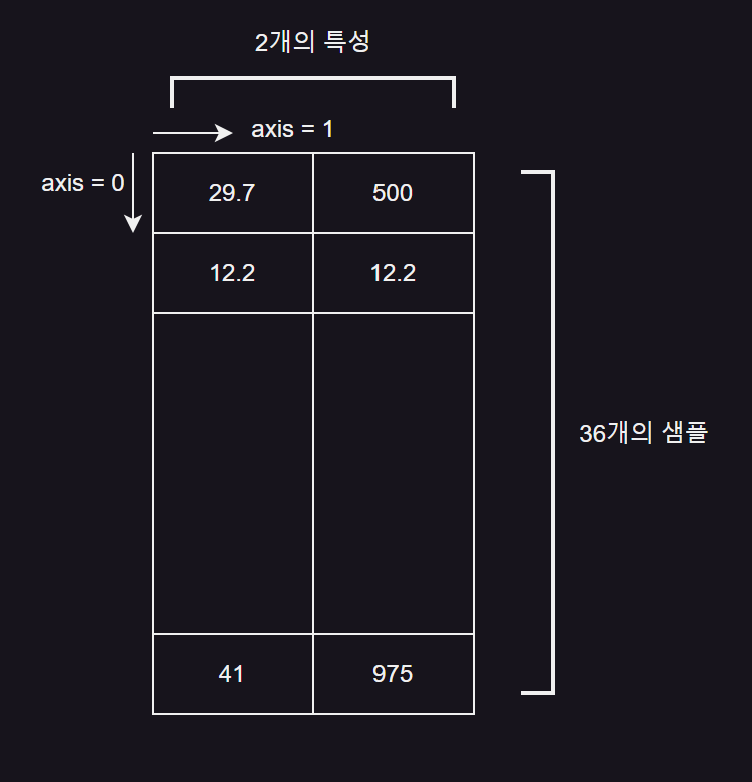
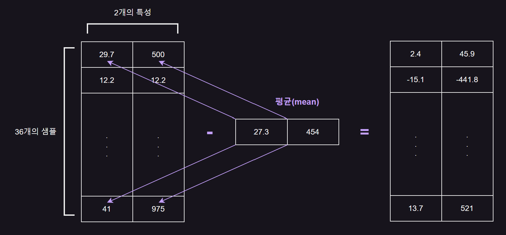
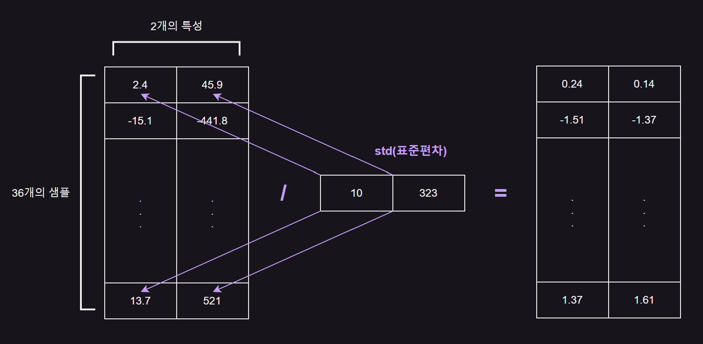

# 데이터 다루기
[01] 훈련 세트와 테스트 세트
---
### 01. 지도 학습과 비지도 학습
#### 지도 학습(supervised learning)
- 지도 학습 알고리즘 : 훈련하기 위한 데이터와 정답 필요

  - ex. k-최근접 이웃 알고리즘

  - **훈련 데이터**(training data) = **입력**(input, 데이터) + **타깃**(target, 정답)
 
- 정답(타깃)이 있으니 알고리즘이 정답을 맞히는 것을 학습

  - ex. 도미인지 빙어인지 구분

<br>

#### 비지도 학습(unsupervised learning)
- 비지도 학습 알고리즘 : 타깃 없이 입력 데이터만 사용

- 정답을 사용하지 않으므로 무언가를 맞힐 수 없음

- 데이터 파악 또는 변형에 도움

<br>

#### 강화 학습(reinforcement learning)
- 강화 학습 알고리즘 : 타깃이 아니라 알고리즘이 행동한 결과로 얻은 보상을 사용해 학습됨

<br>

### 02. 훈련 세트와 테스트 세트
- 머신러닝 알고르짐의 성능을 제대로 평가하려면 훈련 데이터와 평가에 사용할 데이터가 각각 달라야 함

  - 평가를 위해 또 다른 데이터를 준비
 
  - 이미 준비된 데이터 중에서 일부를 떼어 내어 활용 (일반적으로 많이 사용)
 
<BR>

#### 테스트 세트(test set)
- 평가에 사용하는 데이터

<br>

#### 훈련 세트(train set)
- 훈련에 사용되는 데이터

<br>

> 도미와 빙어의 데이터를 합쳐 하나의 파이썬 리스트로 준비
```python
  fish_length = [25.4, 26.3, 26.5, 29.0, 29.0, 29.7, 29.7, 30.0, 30.0, 30.7, 
                  31.0, 31.0, 31.5, 32.0, 32.0, 32.0, 33.0, 33.0, 33.5, 33.5,
                  34.0, 34.0, 34.5, 35.0, 35.0, 35.0, 35.0, 36.0, 36.0, 37.0,
                  38.5, 38.5, 39.5, 41.0, 41.0, 9.8, 10.5, 10.6, 11.0, 11.2, 
                  11.3, 11.8, 11.8, 12.0, 12.2, 12.4, 13.0, 14.3, 15.0]
  fish_weight = [242.0, 290.0, 340.0, 363.0, 430.0, 450.0, 500.0, 390.0,
                  450.0, 500.0, 475.0, 500.0, 500.0, 340.0, 600.0, 600.0,
                  700.0, 700.0, 610.0, 650.0, 575.0, 685.0, 620.0, 680.0,
                  700.0, 725.0, 720.0, 714.0, 850.0, 1000.0, 920.0, 955.0,
                  925.0, 975.0, 950.0, 6.7, 7.5, 7.0, 9.7, 9.8, 8.7, 10.0, 
                  9.9, 9.8, 12.2, 13.4, 12.2, 19.7, 19.9]
```

> 두 파이썬 리스트를 순회하면서 각 생선의 길이와 무게를 하나의 리스트로 담은 2차원 리스트 생성
```python
  fish_data = [[l, w] for l, w in zip(fish_length, fish_weight)]
  fish_target = [1] * 35 + [0] * 14
```
- 하나의 생선 데이터를 **샘플**이라 부름

  - 도미와 빙어는 각각 35마리, 14마리가 있으므로 전체 데이터는 49개의 샘플로 이루어져 있음
 
- 사용하는 특성은 2개 (길이, 무게)

<br>

<details>
  <summary>💡 인덱스 지정 및 슬라이싱</summary>

<br>

> 코드
```python
  # 인덱스 지정
  print(fish_data[4], '\n')
  
  # 슬라이싱
  print(fish_data[0:5])
  print(fish_data[:5])
  print(fish_data[44:49])
  print(fish_data[44:])
```
- 리스트처럼 배열의 요소를 선택할 때는 배열의 위치(**인덱스**, index) 지정

  - 배열의 인덱스는 0부터 시작 → 다섯 번째 샘플의 인덱스 = 4
 
- **슬라이싱**(slicing) : 콜론(:)을 가운데 두고 인덱스의 범위를 지정하여 여러 개의 원소 선택 가능

  - **마지막 인덱스의 원소는 포함되지 않는다**는 점 주의
 
    - ex. '0:5' ⇒ 0~4 까지의 5개 원소만 선택되고 인덱스 5인 여섯 번째 원소는 선택 X
   
      - 처음부터 시작되는 슬라이싱의 경우 0 생략 가능
     
    - ex. '44:49' ⇒ '44:' 로 사용 가능
     
      - 마지막 원소까지 포함할 경우 두 번재 인덱스 생략 가능

<br>

> 결과
```python
  [29.0, 430.0] 
  
  [[25.4, 242.0], [26.3, 290.0], [26.5, 340.0], [29.0, 363.0], [29.0, 430.0]]
  [[25.4, 242.0], [26.3, 290.0], [26.5, 340.0], [29.0, 363.0], [29.0, 430.0]]
  [[12.2, 12.2], [12.4, 13.4], [13.0, 12.2], [14.3, 19.7], [15.0, 19.9]]
  [[12.2, 12.2], [12.4, 13.4], [13.0, 12.2], [14.3, 19.7], [15.0, 19.9]]
```

</details>

<br>

> 처음 35개를 훈련 세트로, 나머지 14개를 테스트 세트로 사용
```python
  from sklearn.neighbors import KNeighborsClassifier
  kn = KNeighborsClassifier()
  
  # 훈련 세트로 입력값 중 0부터 34번째 인덱스까지 사용
  train_input = fish_data[:35]
  # 훈련 세트로 타깃값 중 0부터 34번째 인덱스까지 사용
  train_target = fish_target[:35]
  # 테스트 세트로 입력값 중 35번째부터 마지막 인덱스까지 사용
  test_input = fish_data[35:]
  # 테스트 세트로 타깃값 중 35번째부터 마지막 인덱스까지 사용
  test_target = fish_target[35:]
  
  kn.fit(train_input, train_target)
  kn.score(test_input, test_target)
```
-  슬라이싱 연산으로 인덱스 0\~34 까지 처음 35개 샘플을 훈련 세트로 선택, 인덱스 35\~48 까지 나머지 14개 샘플을 테스트 세트로 선택

-  데이터 준비 후 훈련 세트로 fit() 메서드를 호출해 모델 훈련 후 테스트 세트로, score() 메서트를 호출해 평가

> 결과
```python
  0.0
```
- 최악의 성능 why?

  - fish_data 에 순서대로 35개의 도미와 14개의 빙어 샘플이 들어있음
 
    - 마지막 14개를 테스트 세트로 만들면 빙어 데이터만 들어감
   
    - 훈련 세트에는 도미만 있기 때문에 테스트 세트가 무엇이든 무조건 도미라고 분류하므로 정답 맞히지 못함
   
- 훈련 데이터와 테스트 데이터에는 도미와 빙어가 골고루 섞여 있어야 함

<br>

### 03. 샘플링 편향(sampling bias)
- 훈련 세트와 테스트 세트에 샘플이 골고루 섞여 있지 않으면 샘플링이 한쪽으로 치우친 상태

- 특정 종류의 샘플이 과도하게 많은 샘플링 편향을 가지고 있다면 제대로 된 지도 학습 모델을 만들 수 없음

<br>

### 04. 넘파이(numpy)
- 파이썬의 대표적인 배열(array) 라이브러리

- 고차원의 배열을 손쉽게 만들고 조작할 수 있는 간편한 도구 많이 제공

  - 파이썬의 리스트로 2차원 리스트는 표현 가능하지만 고차원 리스트 표현은 번거로움

  - 차원(dimension)이란 말은 조금씩 다른 의미로 쓰일 수 있으나 배열에서 차원은 좌표계의 축과 같음

|1차원 배열|2차원 배열|3차원 배열|
|:-:|:-:|:-:|
||||
|선|면|공간|

- 배열의 시작점이 왼쪽 위에서부터 시작함

<br>

> 생선 데이터를 2차원 넘파이 배열로 변환
```python
  import numpy as np
  
  input_arr = np.array(fish_data)
  target_arr = np.array(fish_target)
  
  print(input_arr)
  print(input_arr.shape)  # (샘플 수, 특성 수) 출력
```
- 파이썬 리스트를 넘파이 배열로 바꾸는 방법

  - 넘파이 array() 함수에 파이썬 리스트를 전달
 
- shape 속성 : 배열의 크기 확인

> 결과
```python
  [[  25.4  242. ]
   [  26.3  290. ]
    ...
   [  15.    19.9]]
  (49, 2)
```
- 넘파이는 배열의 차원을 구분하기 쉽도록 행과 열을 가지런히 출력

  - 49개의 행과 2개의 열 확인 가능
 
<br>

> 랜덤으로 샘플 선택
```python
  np.random.seed(42)
  index = np.arange(49)
  np.random.shuffle(index)
  
  print(index)
```
- 배열을 섞은 후에 나누는 방식 대신 무작위로 샘플을 고르는 방법 사용

  - input_arr 와 target_arr 에서 같은 위치는 함께 선택되어야 함
 
- 인덱스를 섞은 다음 input_arr 와 target_arr 에서 샘플을 선택하면 무작위로 훈련 세트를 나누는 셈

- 넘파이 arange() 함수 사용하면 0에서부터 48까지 1씩 증가하는 인덱스 생성 가능

  - 정수 N 을 전달하면 0에서부터 N-1 까지 1씩 증가하는 배열을 만듦
 
    - 넘파이 random 패키지 아래에 있는 shuffle() 함수는 주어진 배열을 무작위로 섞음

> 결과
```python
  [13 45 47 44 17 27 26 25 31 19 12  4 34  8  3  6 40 41 46 15  9 16 24 33
   30  0 43 32  5 29 11 36  1 21  2 37 35 23 39 10 22 18 48 20  7 42 14 28
   38]
```

<br>

> 배열 인덱싱
```python
  print(input_arr[[1, 3]])
```
- input_arr 에서 두 번째와 네 번째 샘플을 선택하여 출력

> 결과
```python
  [[ 26.3 290. ]
   [ 29.  363. ]]
```
- 넘파이는 슬라이싱 외에 **배열 인덱싱**(array indexing) 기능 제공

  - 배열 인덱싱은 1개의 인덱스가 아닌 여러 개의 인덱스로 한 번에 여러 개의 원소 선택 가능

<br>

> 리스트 대신 넘파이 배열을 인데스로 전달
```python
  train_input = input_arr[index[:35]]
  train_target = target_arr[index[:35]]
  
  print(input_arr[13], train_input[0])
```
- index 배열의 처음 35개를 input_arr 와 target_arr 에 전달하여 랜덤하게 35개의 샘플을 훈련 세트로 만들기

> 결과
```python
  [ 32. 340.] [ 32. 340.]
```
- 만들어진 index 의 첫 번째 값은 13

  - train_input 의 첫 번째 원소는 input_arr 의 열네 번째 원소가 들어있을 것

<br>

> 나머지 14개를 테스트 세트로 만들기
```python
  test_input = input_arr[index[35:]]
  test_target = target_arr[index[35:]]
```

<br>

> 훈련 세트와 테스트 세트에 도미와 방어가 잘 섞여 있는지 산점도로 확인
```python
  import matplotlib.pyplot as plt
  plt.scatter(train_input[:, 0], train_input[:, 1])
  plt.scatter(test_input[:, 0], test_input[:, 1])
  plt.xlabel('length')
  plt.ylabel('weight')
  plt.show()
```
- 2차원 배열은 행과 열 인덱스를 콤마(,)로 나누어 지정

  - 슬라이싱 연산자로 처음부터 마지막 원소까지 모두 선택하는 경우 시작과 종료 인덱스를 모두 생략 가능
 
> 결과


- 파란색 : 훈련 세트, 주황색 : 테스트 세트

  - 양쪽에 도미와 빙어가 모두 섞여 있음

<br>

#### 💡 넘파이에서 무작위 결과를 만드는 함수들은 실행할 때마다 다른 결과를 만듦
- 일정한 결과를 얻으려면 초기에 랜덤시드(random seed) 지정

<br>

### 05. 두 번째 머신러닝 프로그램
- 앞서 만든 훈련 세트와 테스트 세트로 k-최근접 이웃 모델 훈련

- fit() 메서드 실행할 때마다 KNeighborsClassifier 클래스의 객체는 이전에 학습한 모든 것을 잃어버림

  - 이전 모델을 그대로 두고 싶다면 KNeighborsClassifier 클래스 객체 새로 생성

> 훈련
```python
  kn.fit(train_input, train_target)
  
  # 인덱스를 섞어 만든 train_input 과 train_target 으로 모델 훈련
  kn.score(test_input, test_target)
```

> 결과
```python
  1.0
```
- 100% 정확도로 테스트 세트에 있는 모든 생성 맞힘

<br>

> 예측
```python
  print(kn.predict(test_input))
  print(test_target)
```
- predict() 메서드로 테스트 세트의 예측 결과와 실제 타깃 확인

> 결과
```python
  [0 0 1 0 1 1 1 0 1 1 0 1 1 0]
  [0 0 1 0 1 1 1 0 1 1 0 1 1 0]
```
- predict() 메서드가 반환하는 값은 단순한 파이썬 리스트가 아니라 넘파이 배열

  - print 없이 출력시 array() 로 감싸여 있음
 
  - 사이킷런 모델의 입력과 출력은 모두 넘파이 배열
 
    - 넘파이는 많은 파이썬 과학 라이브러리에서 사용하는 표준 데이터

<br>

> 전체 코드
```python
fish_length = [25.4, 26.3, 26.5, 29.0, 29.0, 29.7, 29.7, 30.0, 30.0, 30.7, 
                31.0, 31.0, 31.5, 32.0, 32.0, 32.0, 33.0, 33.0, 33.5, 33.5,
                34.0, 34.0, 34.5, 35.0, 35.0, 35.0, 35.0, 36.0, 36.0, 37.0,
                38.5, 38.5, 39.5, 41.0, 41.0, 9.8, 10.5, 10.6, 11.0, 11.2, 
                11.3, 11.8, 11.8, 12.0, 12.2, 12.4, 13.0, 14.3, 15.0]
fish_weight = [242.0, 290.0, 340.0, 363.0, 430.0, 450.0, 500.0, 390.0,
                450.0, 500.0, 475.0, 500.0, 500.0, 340.0, 600.0, 600.0,
                700.0, 700.0, 610.0, 650.0, 575.0, 685.0, 620.0, 680.0,
                700.0, 725.0, 720.0, 714.0, 850.0, 1000.0, 920.0, 955.0,
                925.0, 975.0, 950.0, 6.7, 7.5, 7.0, 9.7, 9.8, 8.7, 10.0, 
                9.9, 9.8, 12.2, 13.4, 12.2, 19.7, 19.9]

fish_data = [[l, w] for l, w in zip(fish_length, fish_weight)]
fish_target = [1] * 35 + [0] * 14

from sklearn.neighbors import KNeighborsClassifier
kn = KNeighborsClassifier()

# 훈련 세트로 입력값 중 0부터 34번째 인덱스까지 사용
train_input = fish_data[:35]
# 훈련 세트로 타깃값 중 0부터 34번째 인덱스까지 사용
train_target = fish_target[:35]
# 테스트 세트로 입력값 중 35번째부터 마지막 인덱스까지 사용
test_input = fish_data[35:]
# 테스트 세트로 타깃값 중 35번째부터 마지막 인덱스까지 사용
test_target = fish_target[35:]

kn.fit(train_input, train_target)
kn.score(test_input, test_target)

# 넘파이
import numpy as np

input_arr = np.array(fish_data)
target_arr = np.array(fish_target)

print(input_arr)
print(input_arr.shape)  # (샘플 수, 특성 수) 출력

np.random.seed(42)
index = np.arange(49)
np.random.shuffle(index)

print(index)

print(input_arr[[1, 3]])

train_input = input_arr[index[:35]]
train_target = target_arr[index[:35]]

print(input_arr[13], train_input[0])

test_input = input_arr[index[35:]]
test_target = target_arr[index[35:]]

import matplotlib.pyplot as plt
plt.scatter(train_input[:, 0], train_input[:, 1])
plt.scatter(test_input[:, 0], test_input[:, 1])
plt.xlabel('length')
plt.ylabel('weight')
plt.show()

# 머신러닝 프로그램
kn.fit(train_input, train_target)

kn.score(test_input, test_target)

print(kn.predict(test_input))
print(test_target)
```

<br>  

---

<br>

🚨 핵심 정리
---
- **지도 학습** : 입력과 타깃을 전달하여 모델을 훈련한 다음 새로운 데이터를 예측하는 데 활용

  - k-최근접 이웃이 지도 학습 알고리즘
 
- **비지도 학습** : 타깃 데이터 없음

  - 무엇을 예측하는 것이 아니라 입력 데이터에서 어떤 특징을 찾는 데 주로 활용
 
- **훈련 세트** : 모델을 훈련할 때 사용하는 데이터

  - 보통 훈련 세트가 클수록 좋음
 
  - 테스트 세트를 제외한 모든 데이터를 사용
 
- **테스트 세트** : 전체 데이터에서 20~30%를 테스트 세트로 사용하는 경우가 많음

  - 전체 데이터가 아주 크다면 1%만 덜어내도 충분할 수 있음
 
- **numpy**

  - **seed()** : 넘파이에서 난수를 생성하기 위한 정수 초기값 지정
 
    - 초기값이 같으면 동일한 난수 뽑을 수 있음
   
    - 랜덤 함수의 결과를 동일하게 재현하고 싶을 때 사용
   
  - **arange()** : 일정한 간격의 정수 또는 실수 배열 생성
 
    - 기본 간격은 1
   
    - 매개변수가 하나이면 종료 숫자 의미
   
    - 0에서 종료 숫자까지 배열 생성
   
    - 종료 숫자는 배열에 포함되지 않음
   
    - 매개변수가 2개면 시작 숫자, 종료 숫자 의미
   
    - 매개변수가 3개면 마지막 매개변수가 간격을 나타냄
   
  - **shuffle()** : 주어진 배열을 랜덤하게 섞음
 
    - 다차원 배열일 경우 첫 번째 축(행)에 대해서만 섞음

> ex
```python
  print(np.arange(3))
  print(np.arange(1, 3))
  print(np.arange(1, 3, 0.2))
  
  arr = np.array([[1, 2], [3, 4], [5, 6]])
  np.random.shuffle(arr)
  print(arr)
```

> 결과
```python
  [0 1 2]
  [1 2]
  [1.  1.2 1.4 1.6 1.8 2.  2.2 2.4 2.6 2.8]
  
  [[5 6]
   [1 2]
   [3 4]]
```

<br>  

---

<br>

[2] 데이터 전처리
---
### 01. 넘파이로 데이터 준비
> 생선 데이터
```python
  fish_length = [25.4, 26.3, 26.5, 29.0, 29.0, 29.7, 29.7, 30.0, 30.0, 30.7, 
                  31.0, 31.0, 31.5, 32.0, 32.0, 32.0, 33.0, 33.0, 33.5, 33.5,
                  34.0, 34.0, 34.5, 35.0, 35.0, 35.0, 35.0, 36.0, 36.0, 37.0,
                  38.5, 38.5, 39.5, 41.0, 41.0, 9.8, 10.5, 10.6, 11.0, 11.2, 
                  11.3, 11.8, 11.8, 12.0, 12.2, 12.4, 13.0, 14.3, 15.0]
  fish_weight = [242.0, 290.0, 340.0, 363.0, 430.0, 450.0, 500.0, 390.0,
                  450.0, 500.0, 475.0, 500.0, 500.0, 340.0, 600.0, 600.0,
                  700.0, 700.0, 610.0, 650.0, 575.0, 685.0, 620.0, 680.0,
                  700.0, 725.0, 720.0, 714.0, 850.0, 1000.0, 920.0, 955.0,
                  925.0, 975.0, 950.0, 6.7, 7.5, 7.0, 9.7, 9.8, 8.7, 10.0, 
                  9.9, 9.8, 12.2, 13.4, 12.2, 19.7, 19.9]
```
- 이전에는 파이선 리스트를 순회하면서 원소를 하나씩 꺼내 리스트 안의 리스트로 직접 구성

<br>

> 넘파이 생성 예제
```python
  import numpy as np
  np.column_stack(([1,2,3],[4,5,6]))
```
- column_stack() 함수 : 전달받은 리스트를 일렬로 세운 다음 차례대로 나란히 연결

> 결과
```python
  array([[1, 4],
         [2, 5],
         [3, 6]])
```
- 만들어진 배열은 (3, 2) 크기의 배열 ⇒ 3개의 행, 2개의 열

<br>

> fish_length 와 fish_weight 합치기
```python
  fish_data = np.column_stack((fish_length, fish_weight))
  print(fish_data[:5])
```

> 결과
```python
  [[ 25.4 242. ]
   [ 26.3 290. ]
   [ 26.5 340. ]
   [ 29.  363. ]
   [ 29.  430. ]]
```
- 넘파이 배열 출력시 리스트처럼 한 줄로 길게 출력되지 않고 행과 열을 맞춰 정리된 모습으로 보임

<br>

#### 💡 튜플(tuple)
- 파이썬 튜플은 리스트와 매우 비슷함

- 리스트처럼 원소에 순서가 있지만 한 번 만들어진 튜플은 수정 불가

- 튜플을 사용하면 함수로 전달한 값이 바뀌지 않는다는 것을 믿을 수 있음

  - 매개변수 값으로 많이 사용

<br>

> 타깃 데이터 생성
```python
  fish_target = np.concatenate((np.ones(35), np.zeros(14)))
  print(fish_target)
```
- np.ones(), np.zeros() : 각각 원하는 개수의 1과 0을 채운 배열 생성해줌

- np.concatenate() : 첫 번째 차원을 따라 배열 연결

  - np.column_stack() 과 마찬가지로 연결한 리스트나 배열을 튜플로 전달해야 함

> 결과
```python
  [1. 1. 1. 1. 1. 1. 1. 1. 1. 1. 1. 1. 1. 1. 1. 1. 1. 1. 1. 1. 1. 1. 1. 1.
   1. 1. 1. 1. 1. 1. 1. 1. 1. 1. 1. 0. 0. 0. 0. 0. 0. 0. 0. 0. 0. 0. 0. 0.
   0.]
```

<br>

|np.column_stack() VS np.concatenate()|
|:-:|
||

<br>

### 02. 사이킷런으로 훈련 세트와 테스트 세트 나누기
> 사이킷런 활용
```python
  from sklearn.model_selection import train_test_split
  train_input, test_input, train_target, test_target = train_test_split(fish_data, fish_target, random_state=42)
  print(train_input.shape, test_input.shape)
  print(train_target.shape, test_target.shape)
```
- train_test_split() : 전달되는 리스트나 배열을 비율에 맞게 훈련 세트와 테스트 세트로 나누어 줌(나누기 전에 알아서 섞어줌)

  - 사이킷런의 model_selection 모듈 아래 있음
 
  - 기본적으로 35% 테스트 세트로 떼어냄

- fish_data 와 fish_target 2개의 배열 전달 → 2개씩 나뉘어 총 4개의 배열 반환

  - 차례대로 처음 2개는 입력 데이터(train_input, test_input), 나머지 2개는 타깃 데이터(train_target, test_target)
 
- 랜덤 시드(randon_state)는 42로 지정

> 결과
```python
  (36, 2) (13, 2)
  (36,) (13,)
```
- 훈련 데이터와 테스트 데이터를 각각 36개, 13개로 나눔

  - 입력 데이터 : 2개의 열이 있는 2차원 배열
 
  - 타깃 데이터 : 1차원 배열
 
- 넘파이 배열의 크기는 파이썬의 튜플로 표현

  - 튜플의 원소가 하나면 원소 뒤에 콤마 추가
 
    - 타깃 데이터는 1차원 배열ㄹ이므로 원소가 하나인 튜플로 표현된 것

<br>

> 테스트 데이터 출력
```python
  print(test_target)
```

> 결과
```python
  [1. 0. 0. 0. 1. 1. 1. 1. 1. 1. 1. 1. 1.]
```
- 13개의 테스트 세트 중 10개가 도미(1), 3개가 빙어(0) ⇒ 두 생선의 비율 3.3:1

  - 일부 클래스의 개수가 적을 때 샘플링 편향 발생
 
<br>

> 개선
```python
  train_input, test_input, train_target, test_target = train_test_split(fish_data, fish_target, stratify=fish_target, random_state=42)
  print(test_target)
```
- stratify 매개변수에 타깃 데이터 전달시 클래스 비율에 맞게 데이터 나눠줌

> 결과
```python
  [0. 0. 1. 0. 1. 0. 1. 1. 1. 1. 1. 1. 1.]
```
- 두 생선의 비율 2.25:1 로 전체 훈련 데이터의 비율과 비슷해짐

<br>

### 03. 수상한 도미 한 마리
> k-최근접 이웃 훈련
```python
  from sklearn.neighbors import KNeighborsClassifier
  kn = KNeighborsClassifier()
  kn.fit(train_input, train_target)
  kn.score(test_input, test_target)
```
- k-최근접 이웃은 훈련 데이터 저장하는 것이 훈련의 전부

> 결과
```python

```
- 완벽한 결과(테스트 세트의 도미와 빙어를 모두 올바르게 분류함)

<br>

> 길이 25, 무게 150 인 도미 데이터 결과 확인
```pythoon
  print(kn.predict([[25, 150]]))
```

> 결과
```python
  [0.]
```
- 도미(1)가 아닌 빙어(0)로 예측

<br>

> 산점도 확인
```python
  import matplotlib.pyplot as plt
  plt.scatter(train_input[:,0], train_input[:,1])
  plt.scatter(25, 150, marker='^')    # marker 매개변수는 모양 지정(^ = 삼각형, D = 마름모)
  plt.xlabel('length')
  plt.ylabel('weight')
  plt.show()
```

> 결과


- 해당 샘플을 도미 데이터에 더 가깝지만 빙어 데이터로 예측된 상황

- k-최근접 이웃은 주변의 샘플 중에서 다수인 클래스를 예측으로 사용

  - KNeighborsClassifier 클래스는 주어진 샘플에서 가장 가까운 이웃을 찾아주는 kneighbors() 메서드 제공
 
    - 이웃까지의 거리와 이웃 샘플의 인덱스 반환
   
    - KNeighborsClassifier 클래스의 이웃 개수인 n_neighbors 기본값은 5 이므로 5개의 이웃 반환됨

<br>

> kneighbors() 사용
```python
  distances, indexes = kn.kneighbors([[25, 150]])
  
  plt.scatter(train_input[:,0], train_input[:,1])
  plt.scatter(25, 150, marker='^')
  plt.scatter(train_input[indexes,0], train_input[indexes,1], marker='D')
  plt.xlabel('length')
  plt.ylabel('weight')
  plt.show()
```
- 넘파이 배열 인덱싱 방법 사용

  - indexes 배열을 사용해 훈련 데이터 중 이웃 샘플을 따로 구분해 표현

> 결과


- 가까운 이웃에 빙어가 압도적으로 많음

<br>

> kneighbors() 메서드에서 반환한 distances 배열 출력
```python
  print(distances)
```

> 결과
```python
  [[ 92.00086956 130.48375378 130.73859415 138.32150953 138.39320793]]
```
- 이 배열에는 이웃 샘플까지의 거리가 담겨있음

<br>

### 04. 기준 맞추기
- 산점도를 다시 확인해보며느 92와 130인 거리 비율이 이상함

  - x축은 범위가 좁고(10\~40), y축은 범위가 넓음(0\~1000)
 
    - y축으로 조금만 멀어져도 거리가 아주 큰 값으로 계산되어 돋미 샘플이 이웃으로 선택되지 못함

- xlim() & ylim() : 맷플롯립에서 x축 범위 or y축 범위를 지정하는 함수

- 두 특성의 값이 놓은 범위가 다를 때, 두 특성의 **스케일**(scale)이 다르다고 표현

- 데이터를 표현하는 기준이 다르면 알고리즘이 올바르게 예측할 수 없음

  - 특히 거리 기반일 경우(ex. k-최근접 이웃)

> x축의 범위를 동일하게 0~1000 으로 맞추기
```python
  plt.scatter(train_input[:, 0], train_input[:, 1])
  plt.scatter(25, 150, marker='^')
  plt.scatter(train_input[indexes, 0], train_input[indexes, 1], marker='D')
  plt.xlim((0, 1000))
  plt.xlabel('length')
  plt.ylabel('weight')
  plt.show()
```

> 결과


- 산점도가 거의 일직선으로 나타남

  - 생선의 길이(x축)를 찾는 데 크게 영향을 미치지 못함
 
  - 생선의 무게(y축)만 고려 대상

<br>

#### 💡 모든 알고리즘이 거리 기반인 것은 아님
- 트리 기반 알고리즘들은 특성의 스케일이 다르더라도 잘 동작함

<br>

### 05 데이터 전처리(data preprocessing)
- 특성값을 일정한 기준으로 맞추는 작업

- **표준점수**(standard score, z 점수) : 가장 널리 사용하는 전처리 방법 중 하나

  - 각 특성값이 평균에서 표준편차의 몇 배만큼 떨어져 있는지 나타냄
 
  - 이를 통해 실제 특성값의 크기와 상관없이 동일한 조건으로 비교 가능

> 계산 방법 : 원본 데이터에서 평균을 빼고 표준편차를 나누면 됨
```python
  mean = np.mean(train_input, axis=0)
  std = np.std(train_input, axis=0)
  
  print(mean, std)
  
  train_scaled = (train_input - mean) / std
```
- np.mean() : 평균 계산

- np.std() : 표준편차 계산

- axis=0 : 행을 따라 각 열의 통계 값 계산

  - 특성마다 값의 스케일이 다르므로 평균과 표준편차는 각 특성별로 계산해야 하기 때문

> 결과
```python
  [ 27.29722222 454.09722222] [  9.98244253 323.29893931]
```

|-|
|-|
||

<br>

#### 💡 표준점수와 표준편차
- 분산은 데이터에서 평균을 뺀 값을 모두 제곱한 다음 평균을 내어 구함

- 표준편차 : 분산의 제곱근

  - 데이터가 분산된 정도를 나타냄

- 표준점수 : 각 데이터가 원점에서 몇 표준편차만큼 떨어져 있는지 나타내는 값

<br>

#### 💡 브로드캐스팅(broadcasting)
- 넘파이 배열 사이에서 일어남

- train_input 의 모든 행에서 mean 에 있는 두 평균값을 빼줌

  - 이후 std 에 있는 두 표준편차를 다시 모든 행에 적용

|mean(평균) 빼기|std(표준편차) 나누기|
|-|-|
|||

<br>

### 06. 전처리 데이터로 모델 훈련
> 표준점수로 변환한 train_scaled 와 샘플의 삼점도
```python
  plt.scatter(train_scaled[:, 0], train_scaled[:, 1])
  plt.scatter(25, 150, marker='^')
  plt.xlabel('length')
  plt.ylabel('weight')
  plt.show()
```

> 결과


- 훈련 세트를 mean(평균)으로 빼고 std(표준편차)로 나줬기 때문에 값이 범위가 크게 달라진 것

  - 샘플 [25, 150] 을 동일한 비율로 변환하지 않으면 이런 현상 발생

- 훈련 세트의 mean, std 를 이용해 변환해야 함

  - 샘플 하나만으로는 평균과 표준편차 구할 수 없음

<br>

> 동일한 기준으로 샘플 변환
```python
  new = ([25, 150] - mean) / std
  plt.scatter(train_scaled[:, 0], train_scaled[:, 1])
  plt.scatter(new[0], new[1], marker='^')
  plt.xlabel('length')
  plt.ylabel('weight')
  plt.show()
```

> 결과


- 표준편차로 변환하기 전의 산점도와 거의 동일

  - x 축과 y 축의 범위가 -1.5 ~ 1.5 사이로 바뀜
 
  - 훈련 데이터의 두 특성이 비슷한 범위를 차지

<br>

> 위 데이터셋으로 k-최근접 이웃 모델 훈련
```python
  kn.fit(train_scaled, train_target)
  test_scaled = (test_input - mean) / std
  print(kn.score(test_scaled, test_target))
  print(kn.predict([new]))
```
- 훈련 후 테스트 세트로 평가시 주의

  - 테스트 세트도 훈련 세트의 평균과 표준편차로 변환
 
    - 하지 않으면 데이터의 스케일이 같아지지 않으므로 훈련 모델 정확하지 않음

> 결과
```python
  1.0
  [1.]
```
- 샘플을 도미(1)로 올바르게 예측

<br>

> kneighbors() 함수로 샘플의 k-최근접 이웃 구한 후 산점도 확인
```python
  distances, indexes = kn.kneighbors([new])
  plt.scatter(train_scaled[:, 0], train_scaled[:, 1])
  plt.scatter(new[0], new[1], marker='^')
  plt.scatter(train_scaled[indexes, 0], train_scaled[indexes, 1], marker='D')
  plt.xlabel('length')
  plt.ylabel('weight')
  plt.show()
```

> 결과


- 특성을 표준점수로 바꾸었기 때문에 k-최근접 이웃 알고리즘이 올바르게 거리 측정

<br>

---

<br>

핵심정리
---
- **데이터 전처리** : 머신러닝 모델에 훈련 데이터를 주입하기 전에 가공하는 단계

  - 때로는 데이터 전처리에 많은 시간이 소모되기도 함
 
- **표준점수** : 훈련 세트의 스케일을 바꾸는 대표적인 방법 중 하나

  - 표준점수를 얻으려면 특성의 평균을 빼고 표준편차로 나눔
 
  - 반드시 훈련 세트의 평균과 표준편차로 테스트 세트를 바꿔야 함
 
- **브로드캐스팅** : 크기가 다른 넘파이 배열에서 자동으로 사칙 연산을 모든 행이나 열로 확장하여 수행하는 기능

- **scikit-learn**

  - **train_test_split()** : 훈련 데이터를 훈련 세트와 테스트 세트로 나누는 함수
 
    - 여러 개의 배열 전달 가능
   
    - test_size 매개변수 : 테스트 세트로 나눌 비율
   
      - 기본값 : 0.25(25%)
     
    - shuffle 매개변수 : 훈련 세트와 테스트 세트로 나누기 전에 무작위로 섞을지 여부 결정
   
      - 기본값 : True
     
    - stratify 매개변수 : 클래스 레이블이 담긴 배열(일반적으로 타깃 데이터) 전달시 클래스 비율에 맞게 훈련 세트와 테스트 세트 분리
   
  - **kneighbors()** : k-최근접 이웃 객체의 메서드
 
    - 입력한 데이터에 가장 가까운 이웃을 찾아 거리와 이웃 샘플의 인덱스 반환
   
    - 기본적으로 이웃의 개수는 KNeighborsClassifier 클래스의 객체를 생성할 때 지정한 개수를 사용
   
      - n_neighbors 매개변수에서 다르게 지정 가능
     
    - return_distance 매개변수 : 이웃 샘플의 거리 반환 여부 결정
   
      - 기본값 : True (이웃 샘플의 인덱스와 거리 반환)
     
        - False (이웃 샘플의 인덱스만 반환하거 거리는 반환 X)

<br>

