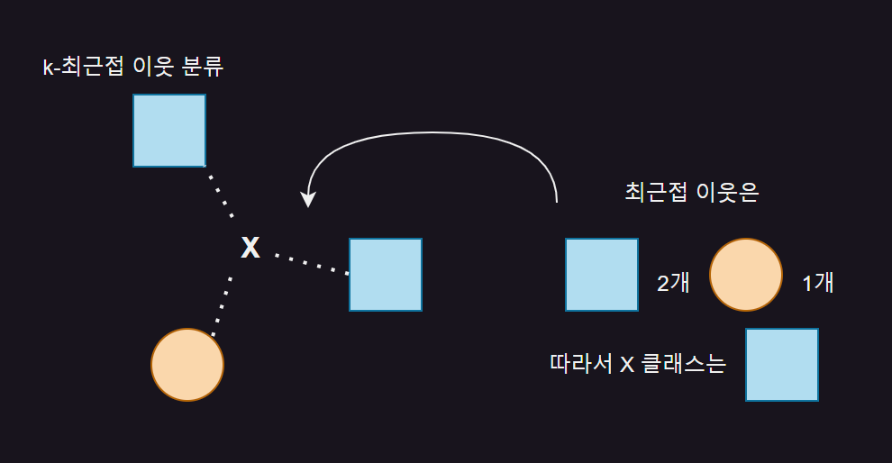
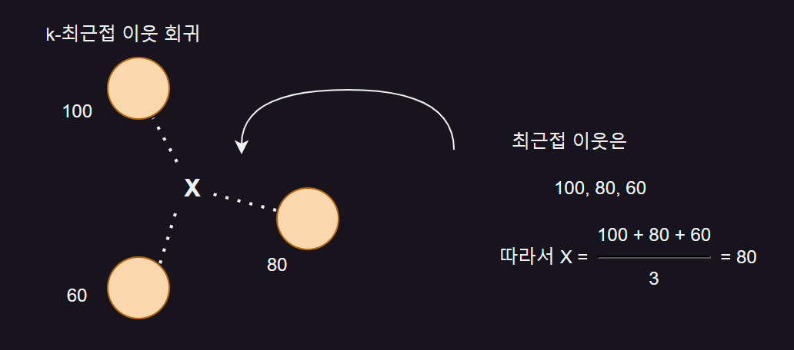

# 회귀 알고리즘과 모델 규제
- 농어 무게 예측

<br>

[01] k-최근접 이웃 회귀
---
- 농어의 길이, 높이, 두께를 측정한 데이터로 농어의 무게 예측 ⇒ 회귀

<br>

### 01. K-최근접 이웃 회귀
- 지도 학습 알고리즘

  - 분류(classifier)
 
    - 샘플을 몇 개의 클래스 중 하나로 분류하는 문제
 
  - 회귀(regression)
 
    - 클래스 중 하나로 분류하는 것이 아니라 임의의 어떤 숫자를 예측하는 문제
   
      - ex) 내년도 경제 성장률 예측, 배달이 도착할 시간 예측, 농어의 무게 예측 등

- k-최근접 이웃 알고리즘이 회귀에도 작동

  - k-최근접 이웃 분류 알고리즘
 
    - 예측하려는 샘플에 가장 가까운 샘플 k 개 선택
   
    - 샘플들의 클래스를 확인하여 다수 클래스를 새로운 샘플의 클래스로 예측
   
  - k-최근접 이웃 회귀 알고리즘
 
    - 예측하려는 샘플에 가장 가까운 샘플 k 개 선택
   
    - 이웃한 샘플의 타깃은 어떤 클래스가 아니라 임의의 수치
   
    - 해당 수치들의 평균 구하여 예측
   
<br>

|k-최근접 이웃 분류|k-최근접 이웃 회귀|
|-|-|
|||
|- k=3(샘플이 3개) 가정시, 사각형이 2개로 다수이므로<br>&nbsp;&nbsp;새로운 샘플 X 클래스는 사각형|- 이웃한 샘플의 타깃값이 각각 100, 80, 60 일 때,<br>&nbsp;&nbsp;평균하면 샘플 X 예측 타깃값은 80|

<br>

#### 💡 회귀 알고리즘의 시작
- 19세기 통계학자이자 사회학자인 프랜시스 골턴(Francis Galton)이 처음 사용

- 키가 큰 사람의 아이가 부모보다 더 크지 않는다는 사실을 관찰하고 이를 '평균으로 회귀한다'라고 표현함

- 회귀 = **두 변수 사이의 상관관계를 분석하는 방법**

<br>

### 02. 데이터 준비
- 특성 : 농어의 길이, 타깃 : 무게
> 데이터 및 산점도
```python
  import numpy as np
  perch_length = np.array(
      [8.4, 13.7, 15.0, 16.2, 17.4, 18.0, 18.7, 19.0, 19.6, 20.0,
      21.0, 21.0, 21.0, 21.3, 22.0, 22.0, 22.0, 22.0, 22.0, 22.5,
      22.5, 22.7, 23.0, 23.5, 24.0, 24.0, 24.6, 25.0, 25.6, 26.5,
      27.3, 27.5, 27.5, 27.5, 28.0, 28.7, 30.0, 32.8, 34.5, 35.0,
      36.5, 36.0, 37.0, 37.0, 39.0, 39.0, 39.0, 40.0, 40.0, 40.0,
      40.0, 42.0, 43.0, 43.0, 43.5, 44.0]
  )
  
  perch_weight = np.array(
      [5.9, 32.0, 40.0, 51.5, 70.0, 100.0, 78.0, 80.0, 85.0, 85.0,
      110.0, 115.0, 125.0, 130.0, 120.0, 120.0, 130.0, 135.0, 110.0,
      130.0, 150.0, 145.0, 150.0, 170.0, 225.0, 145.0, 188.0, 180.0,
      197.0, 218.0, 300.0, 260.0, 265.0, 250.0, 250.0, 300.0, 320.0,
      514.0, 556.0, 840.0, 685.0, 700.0, 700.0, 690.0, 900.0, 650.0,
      820.0, 850.0, 900.0, 1015.0, 820.0, 1100.0, 1000.0, 1100.0,
      1000.0, 1000.0]
  )
  
  import matplotlib.pyplot as plt
  plt.scatter(perch_length, perch_weight)
  plt.xlabel('length')
  plt.ylabel('weight')
  plt.show()
```

> 결과


<br>


