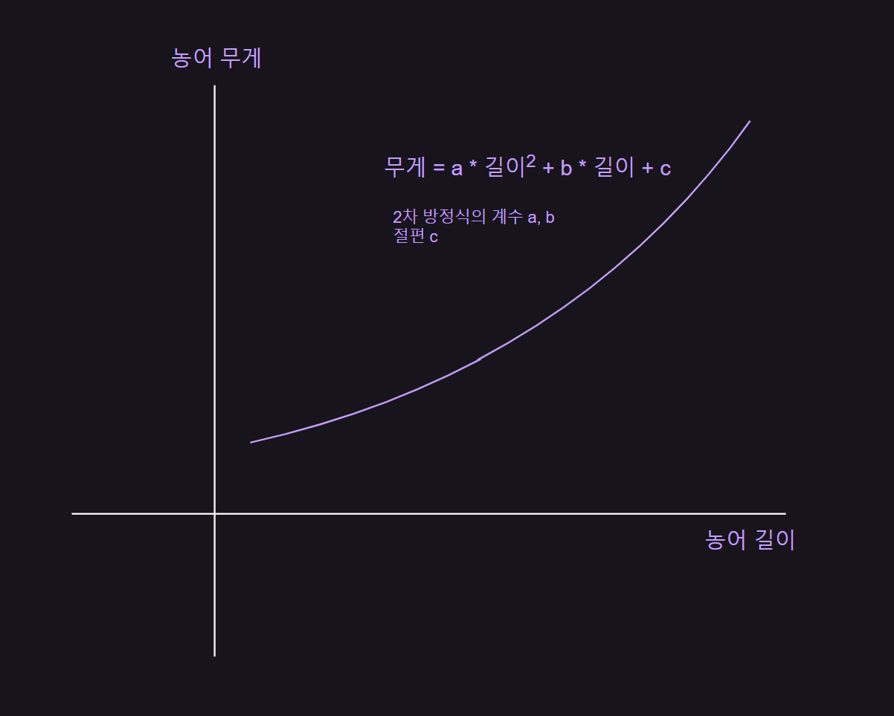

# 회귀 알고리즘과 모델 규제
- 농어 무게 예측

<br>

[01] k-최근접 이웃 회귀
---
- 농어의 길이, 높이, 두께를 측정한 데이터로 농어의 무게 예측 ⇒ 회귀

<br>

### 01. K-최근접 이웃 회귀
- 지도 학습 알고리즘

  - 분류(classifier)
 
    - 샘플을 몇 개의 클래스 중 하나로 분류하는 문제
 
  - 회귀(regression)
 
    - 클래스 중 하나로 분류하는 것이 아니라 임의의 어떤 숫자를 예측하는 문제
   
      - ex) 내년도 경제 성장률 예측, 배달이 도착할 시간 예측, 농어의 무게 예측 등

- k-최근접 이웃 알고리즘이 회귀에도 작동

  - k-최근접 이웃 분류 알고리즘
 
    - 예측하려는 샘플에 가장 가까운 샘플 k 개 선택
   
    - 샘플들의 클래스를 확인하여 다수 클래스를 새로운 샘플의 클래스로 예측
   
  - k-최근접 이웃 회귀 알고리즘
 
    - 예측하려는 샘플에 가장 가까운 샘플 k 개 선택
   
    - 이웃한 샘플의 타깃은 어떤 클래스가 아니라 임의의 수치
   
    - 해당 수치들의 평균 구하여 예측
   
<br>

|k-최근접 이웃 분류|k-최근접 이웃 회귀|
|-|-|
|||
|- k=3(샘플이 3개) 가정시, 사각형이 2개로 다수이므로<br>&nbsp;&nbsp;새로운 샘플 X 클래스는 사각형|- 이웃한 샘플의 타깃값이 각각 100, 80, 60 일 때,<br>&nbsp;&nbsp;평균하면 샘플 X 예측 타깃값은 80|

<br>

#### 💡 회귀 알고리즘의 시작
- 19세기 통계학자이자 사회학자인 프랜시스 골턴(Francis Galton)이 처음 사용

- 키가 큰 사람의 아이가 부모보다 더 크지 않는다는 사실을 관찰하고 이를 '평균으로 회귀한다'라고 표현함

- 회귀 = **두 변수 사이의 상관관계를 분석하는 방법**

<br>

### 02. 데이터 준비
- 특성 : 농어의 길이, 타깃 : 무게
> 데이터 및 산점도
```python
  import numpy as np
  perch_length = np.array(
      [8.4, 13.7, 15.0, 16.2, 17.4, 18.0, 18.7, 19.0, 19.6, 20.0,
      21.0, 21.0, 21.0, 21.3, 22.0, 22.0, 22.0, 22.0, 22.0, 22.5,
      22.5, 22.7, 23.0, 23.5, 24.0, 24.0, 24.6, 25.0, 25.6, 26.5,
      27.3, 27.5, 27.5, 27.5, 28.0, 28.7, 30.0, 32.8, 34.5, 35.0,
      36.5, 36.0, 37.0, 37.0, 39.0, 39.0, 39.0, 40.0, 40.0, 40.0,
      40.0, 42.0, 43.0, 43.0, 43.5, 44.0]
  )
  
  perch_weight = np.array(
      [5.9, 32.0, 40.0, 51.5, 70.0, 100.0, 78.0, 80.0, 85.0, 85.0,
      110.0, 115.0, 125.0, 130.0, 120.0, 120.0, 130.0, 135.0, 110.0,
      130.0, 150.0, 145.0, 150.0, 170.0, 225.0, 145.0, 188.0, 180.0,
      197.0, 218.0, 300.0, 260.0, 265.0, 250.0, 250.0, 300.0, 320.0,
      514.0, 556.0, 840.0, 685.0, 700.0, 700.0, 690.0, 900.0, 650.0,
      820.0, 850.0, 900.0, 1015.0, 820.0, 1100.0, 1000.0, 1100.0,
      1000.0, 1000.0]
  )
  
  import matplotlib.pyplot as plt
  plt.scatter(perch_length, perch_weight)
  plt.xlabel('length')
  plt.ylabel('weight')
  plt.show()
```

> 결과


- 농어의 길이가 커짐에 따라 무게 증가

<br>

- train_test_split() 함수로 훈련 세트와 테스트 세트로 나누기

  - 사이킷런에 사용할 훈련 세트는 2차원 배열

> 데이터 분리 및 2차원 배열 변경
```python
  from sklearn.model_selection import train_test_split
  train_input, test_input, train_target, test_target = train_test_split(perch_length, perch_weight, random_state=42)
  
  train_input = train_input.reshape(-1, 1)
  test_input = test_input.reshape(-1, 1)
  print(train_input.shape, test_input.shape)
```
- perch_length : 1차원 배열 → perch_lenght 를 나눈 train_input, test_input 도 1차원 배열

  - 1차원 배열을 1개의 열이 있는 2차원 배열로 변경 필요

- 배열의 크기 자동 지정

  - 크기에 -1 지정시 나머지 원소 개수로 모두 채우라는 의미
 
  - train_input.reshape(-1, 1) : 첫 번째 크기를 나머지 원소 개수로 채우고, 두번째 크기를 1로 하기

> 결과
```python
  (42, 1) (14, 1)
```

<br>

#### 💡 1차원 배열과 2차원 배열

|1차원 배열|2차원 배열|
|:-:|:-:|
|[1, 2, 3]|[[1],<br>[2],<br>[3]]|
|크기 : (3, )|크기 : (3, 1)|

- 1차원 배열의 크기는 원소가 1개인 튜플로 나타냄

  - 2차원 배열로 만들기 위해 하나의 열을 추가
 
    - 배열을 나타내는 방식만 달라졌을 뿐 배열에 있는 원소의 개수는 동일하게 3개

<br>

> ex. (4,) 배열 → (2,2) 배열 크기 변경
```python
  test_array = np.array([1, 2, 3, 4])
  print(test_array.shape)
  
  test_array = test_array.reshape(2, 2)
  print(test_array.shape)
```
- reshape() : 바꾸려는 배열의 크기 지정 가능

> 결과
```python
  (4,)
  (2, 2)
```

<br>

<details>
  <summary>🚨 지정한 크기와 원본 배열의 원소 개수가 달라도 될까?</summary>

<br>

- reshape() 메서드는 크기가 바뀐 새로운 배열을 반환할 때 지정한 크기가 원본 배열에 있는 원소의 개수와 다르면 에러 발생

> ex) (4, ) → (2, 3) 변경 : 에러 발생
```python
  test_array = test_array.reshape(2, 3)
```

> 결과
```python
  ---------------------------------------------------------------------------
  ValueError                                Traceback (most recent call last)
  Cell In[10], line 1
  ----> 1 test_array = test_array.reshape(2, 3)
  
  ValueError: cannot reshape array of size 4 into shape (2,3)
```
- 원본 배열의 원소는 4개인데 2 * 3 = 6 개로 바꾸려고 했기 때문에 에러 발생

</details>

<br>


### 03. 결정계수(R², coefficient of determination)
- KNeighborsRegressor() : 사이킷런에서 k-최근접 이웃 회귀 알고리즘을 구현한 클래스

  - 객체를 생성하고 fit() 메서드로 회귀 모델 훈련

- 결정계수 = 1 - (타깃-예측)² 의 합 / (타깃-평균)²의 합

  - 타깃의 평균 정도를 예측하는 수준이라면 (분자와 분모가 비슷해져) R² 은 0에 가까워짐
 
  - 예측이 타깃에 아주 가까워지면 (분자가 0에 가까워지기 때문에) R² 은 1에 가까워짐

> 훈련 및 점수(결정계수) 확인
```python
  from sklearn.neighbors import KNeighborsRegressor
  
  knr = KNeighborsRegressor()
  
  # k-최근접 이웃 회귀 모델 훈련
  knr.fit(train_input, train_target)
  
  # 테스트 세트 점수 확인
  print(knr.score(test_input, test_target))
```
- score() 메서드의 출력값 의미

  - 높을수록 좋은 것
 
    - 결정계수, 정확도
   
      - 정확도 : 분류의 경우 테스트 세트에 있는 샘플을 정확하게 분류한 개수의 비율(정답 맞힌 개수의 비율)
   
  - 에러율을 반환한다면 음수로 만들어 실제로는 낮은 에러가 score() 메서드로 반환될 때는 높은 값이 되도록 바꿈

> 결과
```python
  0.992809406101064
```

<br>

> 타깃과 예측한 값 사이의 차이
```python
  from sklearn.metrics import mean_absolute_error
  
  # 테스트 세트에 대한 예측
  test_prediction = knr.predict(test_input)
  
  # 테스트 세트에 데한 평균 절댓값 오차 계산
  mae = mean_absolute_error(test_target, test_prediction)
  print(mae)
```
- mean_absolute_error : 타깃과 예측의 절댓값 오차를 평균하여 반환

> 결과
```python
  19.157142857142862
```
- 예측이 평균적으로 19g 정도 타깃값과 다름

<br>

---

<br>

### 04. 과대적합 vs 과소적합
- 모델을 훈련 세트에 훈련하면 훈련 세트에 맞는 모델이 만들어짐

  - 해당 모델을 훈련 세트와 테스트 세트에서 평가하면 보통 훈련 세트의 점수가 더 높게 나옴
 
    - 훈련 세트에서 모델을 훈련했기 때문에

- **과대적합**(overfiting)

  - 훈련 세트에서 점수가 좋았는데 테스트 세트에서 점수가 나쁜 경우
 
  - 훈련 세트에만 잘 맞는 모델
 
  - 테스트 세트와 실전에 투입하여 새로운 샘플에 대한 예측 만들 때 제대로 동작 X
 
- **과소적합**(underfiting)

  - 훈련 세트보다 테스트 세트의 점수가 높거나 두 점수가 모두 너무 낮은 경우
 
  - 모델이 너무 단순하여 훈련 세트에 적절히 훈련되지 않은 경우
 
  - 발생 원인
 
    - 훈련 세트와 테스트 세트의 크기가 매우 작기 때문
   
      - 데이터가 작으면 테스트 세트가 훈련 세트의 특징을 따르지 못할 수도 있음
 

> 훈련 세트를 사용해 평가
```python
  print(knr.score(train_input, train_target))
```
- score() 메서드에 훈련 세트를 전달하여 점수 출력

> 결과
```python
  0.9698823289099254
```
- 훈련 세트보다 테스트 세트 점수가 높음 → 과소적합

  - 모델을 더 복잡하게 만들기
 
- k-최근접 이웃 알고리즘으로 모델을 더 복잡하게 만드는 방법

  - 이웃의 개수 k 줄이기(사이킷런의 k-최근접 이웃 알고리즘의 기본 k값 = 5)
 
    - 훈련 세트에 있는 국지적인 패턴에 민감해짐
   
    - 이웃의 개수 늘리면 데이터 전반에 있는 일반적인 패턴 따름

> 이웃 개수 줄이기
```python
  # 이웃의 개수를 3으로 설정
  knr.n_neighbors = 3
  
  # 모델 훈련
  knr.fit(train_input, train_target)
  
  # 점수 확인
  print('훈련 세트 점수: ', knr.score(train_input, train_target))
  print('테스트 세트 점수 :', knr.score(test_input, test_target))
```
- k-최근접 이웃 클래스는 이웃 개수를 바꾸기 위해 클래스 객체를 재생성할 필요 없음

  - n_neighbors 속성값 변경

> 결과
```python
  훈련 세트 점수 :  0.9804899950518966
  테스트 세트 점수 : 0.9746459963987609
```
- 테스트 세트 점수 < 훈련 세트 점수 : 과소적합 문제 해결

- 두 점수 차이가 크지 않으므로 과대적합 X

<br>

---

<br>

핵심 정리
---
- **회귀** : 임의의 수치를 예측하는 문제

  - 타깃값도 임의의 수치가 됨
 
- **k-최근접 이웃 회귀** : k-최근접 이웃 알고리즘을 사용해 회귀 문제 풀이

  - 가장 가까운 이웃 샘플을 찾고, 샘플들의 타깃값을 평균하여 예측으로 삼음
 
- **결정계수(R²)** : 대표적은 회귀 문제의 성능 측정 도구

  - 1에 가까울수록 좋고, 0에 가까울수록 성능이 나쁜 모델
 
- **과대적합** : 모델의 훈련 세트 성능이 테스트 세트 성능보다 훨씬 높을 때 발생

  - 모델이 훈련 세트에 너무 집작해서 데이터에 내재된 거시적인 패턴은 감지하지 못함
 
- **과소적합** : 훈련 세트와 테스트 세트 성능이 모두 동일하게 낮거나 테스트 세트 성능이 오히려 더 높을 때 발생

  - 더 복잡한 모델을 사용해 훈련 세트에 잘 맞는 모델 생성
 
- **scikit-learn**

  - **KNeighborsRegressor** : k-최근접 이웃 회귀 모델을 만드는 사이킷런 클래스
 
    - n_neighbors 매개변수로 이웃 개수 지정
   
      - 기본값 = 5
     
    - 다른 매개변수는 KNeighborsClassifier 클래스와 거의 동일
   
  - **mean_absolute_error()** : 회귀 모델의 평균 절댓값 오차 계산
 
    - 첫 번째 매개변수 : 타깃
   
    - 두 번째 매개변수 : 예측값
   
  - **mean_squared_error()** : 평균 제곱 오차
 
    - 타깃과 예측을 뺀ㄱ ㅏㅄ을 제곱한 다음 전체 샘플에 대해 평균한 값 반환

- **numpy**

  - **reshape()** : 배열의 크기를 바꾸는 메서드
 
    - 바꾸고자 하는 배열의 크기륾 매개변수로 전달
   
      - 바꾸기 전후의 배열 원소 개수는 동일
     
  - 넘파이는 종종 배열의 메서드와 동일한 함수를 별도로 제공
 
    - 함수의 첫 번째 매개변수 : 바꾸고자 하는 배열
   
    - ex) test_array.reshape(2,2) = np.reshape(test_array, (2,2))

<br>

---

<br>

[2] 선형 회귀
---
### 01. k-최근접 이웃의 한계
> 데이터 준비
```python
  import numpy as np
  perch_length = np.array(
      [8.4, 13.7, 15.0, 16.2, 17.4, 18.0, 18.7, 19.0, 19.6, 20.0,
      21.0, 21.0, 21.0, 21.3, 22.0, 22.0, 22.0, 22.0, 22.0, 22.5,
      22.5, 22.7, 23.0, 23.5, 24.0, 24.0, 24.6, 25.0, 25.6, 26.5,
      27.3, 27.5, 27.5, 27.5, 28.0, 28.7, 30.0, 32.8, 34.5, 35.0,
      36.5, 36.0, 37.0, 37.0, 39.0, 39.0, 39.0, 40.0, 40.0, 40.0,
      40.0, 42.0, 43.0, 43.0, 43.5, 44.0]
  )
  
  perch_weight = np.array(
      [5.9, 32.0, 40.0, 51.5, 70.0, 100.0, 78.0, 80.0, 85.0, 85.0,
      110.0, 115.0, 125.0, 130.0, 120.0, 120.0, 130.0, 135.0, 110.0,
      130.0, 150.0, 145.0, 150.0, 170.0, 225.0, 145.0, 188.0, 180.0,
      197.0, 218.0, 300.0, 260.0, 265.0, 250.0, 250.0, 300.0, 320.0,
      514.0, 556.0, 840.0, 685.0, 700.0, 700.0, 690.0, 900.0, 650.0,
      820.0, 850.0, 900.0, 1015.0, 820.0, 1100.0, 1000.0, 1100.0,
      1000.0, 1000.0]
  )
```

<br>

> 훈련
```python
  from sklearn.model_selection import train_test_split
  
  # 훈련 세트와 테스트 세트로 나누기
  train_input, test_input, train_target, test_target = train_test_split(perch_length, perch_weight, random_state=42)
  
  # 훈련 세트와 테스트 세트를 2차원 배열로 변경
  train_input = train_input.reshape(-1, 1)
  test_input = test_input.reshape(-1, 1)
  
  # 최근접 이웃 개수를 3으로 하는 모델 훈련
  from sklearn.neighbors import KNeighborsRegressor
  
  knr = KNeighborsRegressor(n_neighbors=3)
  
  # k-최근접 이웃 회귀 모델 훈련
  knr.fit(train_input, train_target)
  
  # 길이가 50cm 인 농어의 무게 예측
  print(knr.predict([[50]]))
```

> 결과
```python
  [1033.33333333]
```
- 예측 무게는 1,033g 이지만, 실제 무게는 훨씬 더 많이 나감

<br>

> 최근접 이웃 산점도 확인
```python
  import matplotlib.pyplot as plt
  
  # 50cm 농어의 이웃 구하기
  distances, indexes = knr.kneighbors([[50]])
  
  # 훈련 세트의 산점도 그리기
  plt.scatter(train_input, train_target)
  
  # 훈련 세트 중에서 이웃 샘플만 다시 그리기
  plt.scatter(train_input[indexes], train_target[indexes], marker='D')
  
  # 50cm 농어 데이터
  plt.scatter(50, 1033, marker='^')
  plt.xlabel('length')
  plt.ylabel('weight')
  plt.show()

  # 이웃 샘플의 타깃 평균
  print(np.mean(train_target[indexes]))
```
- k-최근접 이웃 모델의 kneighbors() 메서드 사용시 가장 가까운 이웃까지의 거리와 이웃 샘플의 인덱스 확인 가능

> 결과


```python
  1033.3333333333333
```
- 50cm 농어에서 가장 가까운 것은 45cm 근방

  - 이웃 샘플의 타깃의 평균 : 1033.3333333333333

- 새로운 샘플이 훈련 세트의 범위를 벗어나면 엉뚱한 값 예측 가능성有

<br>

> 길이가 100cm 인 농어 무게 예측
```python
  print(knr.predict([[100]]))
  
  # 100cm 농어의 이웃 구하기
  distances, indexes = knr.kneighbors([[100]])
  
  # 훈련 세트와 산점도 그리기
  plt.scatter(train_input, train_target)
  
  # 훈련 세트 중에서 이웃 샘플만 다시 그리기
  plt.scatter(train_input[indexes], train_target[indexes], marker='D')
  
  # 100cm 농어 데이터
  plt.scatter(100, 1033, marker='^')
  plt.xlabel('length')
  plt.ylabel('weight')
  plt.show()
```

> 결과
```python
  [1033.33333333]
```


- 농어가 아무리 커도 무게가 더 늘어나지 않음

<br>

### 02. 선형 회귀(linear regression)
- 널리 사용되는 대표적인 회귀 알고리즘

- 비교적 간단하고 성능이 뛰어나 가장 먼저 배우는 머신러닝 알고리즘 중 하나

- 특성이 하나인 경우 어떤 직선을 학습하는 알고리즘

  - 특성을 가장 잘 나타낼 수 있는 직성 찾아야 함

- 사이킷런은 sklearn.linear_model 패키지 아래 LinearRegressor 클래스로 선형 회귀 알고리즘 구현

> 선형 회귀
```python
  from sklearn.linear_model import LinearRegression
  lr = LinearRegression()
  
  # 선형 회귀 모델 훈련
  lr.fit(train_input, train_target)
  
  # 50cm 농어에 대해 예측
  print(lr.predict([[50]]))
  
  # 기울기(계수, coefficient / 가중치, weight), 절편(intercept) 확인
  print(lr.coef_, lr.intercept_)
```

> 결과
```python
  [1241.83860323]
  [39.01714496] -709.0186449535477
```

<br>

<details>
  <summary>💡 기울기와 절편</summary>

<br>

- 하나의 직선을 그리려면 기울기와 절편 필요

- y = a * x + b

  - x : 높어의 길이, y : 농어의 무게

<br>

|-|
|-|
||

</details>

<br>

#### 💡 용어 확인
- coef_, intercept_ 를 머신러닝 알고리즘이 찾은 값이라는 의미로 **모델 파라미터**(model parameter) 라고 부름

- **모델 기반 학습** : 머신러닝 알고리즘의 훈련 과정은 최적의 모델 파라미터를 찾는 것

- **사례 기반 학습** : 모델 파라미터 없이 훈련 세트를 저장하는 것이 훈련의 전부인 것 (ex. k-최근접 이웃)

<br>

- 농어의 길이 15~50까지 직선으로 그리기 : 15, 50의 무게 잇기

  - 농어 무게 = 기울기 * 농어 길이 + 절편

> 훈련 세트의 산점도
```python
  # 훈련 세트의 산점도 그리기
  plt.scatter(train_input, train_target)
  
  # 15에서 50까지 1차 방정식 그래프
  plt.plot([15, 50], [15*lr.coef_+lr.intercept_, 50*lr.coef_+lr.intercept_])
  
  # 50cm 농어 데이터
  plt.scatter(50, 1241.8, marker='^')
  plt.xlabel('length')
  plt.ylabel('weight')
  plt.show()
  
  # 결정계수
  print(lr.score(train_input, train_target))      # 훈련 세트
  print(lr.score(test_input, test_target))        # 테스트 세트
```

> 결과


```python
  0.939846333997604
  0.8247503123313558
```
- 훈련 세트와 테스트 세트의 점수가 차이가 나지만 전체적으로 점수가 낮음

  - 과소적합 + 다른 문제
 
    - 직선이 왼쪽 아래로 쭉 뻗어 있음 → 농어의 무게가 0g 이하로 내려갈수도 있음(현실적으로 불가능)

<br>

### 03. 다항 회귀(polynomial regression)
- 다항식을 사용한 선형 회귀

<br>

|최적의 곡선|
|-|
||
|위와 같은 2차 방정식의 그래프를 그리려면 길이를 제곱한 항이 훈련 세트에 추가되어야 함|

<br>

> column_stack() 함수 사용
```python
  train_poly = np.column_stack((train_input ** 2, train_input))
  test_poly = np.column_stack((test_input ** 2, test_input))
  
  print(train_poly.shape, test_poly.shape)
  
  # 선형 회귀 모델 훈련
  lr = LinearRegression()
  lr.fit(train_poly, train_target)
  
  print(lr.predict([[50**2, 50]]))
  
  # 게수와 절편
  print(lr.coef_, lr.intercept_)
```
- 2차 방정식 그래프를 찾기 위해 훈련 세트에 제곱 항을 추가했지만, 타깃값은 그대로 사용

  - 목표하는 값은 어떤 그래프를 훈련하든지 바꿀 필요 X

> 결과
```python
  (42, 2) (14, 2)
  [1573.98423528]
  [  1.01433211 -21.55792498] 116.05021078278259
```
- 이 모델은 다음과 같은 그래프 학습

  - 무게 = 1.01 * 길이² - 21.6 * 길이 +116.05

<br>

#### 💡 2차 방정식도 선형 회귀일까?
- 2차 방정식인데 비선형(non-linear)이 아닌 선형 회귀?

  - 길이² 을 간단히 다른 변수로 치환 가능하기 때문
 
  - ex) 길이² == 왕길이 ⇒ '무게 = 1.01 * 왕길이 - 21.6 * 길이 + 116.05'
 
    - 무게는 왕길이와 길이의 선형 관계로 표현 가능

<br>

> 훈련 세트의 산점도
```python
  # 구간별 직선을 그리기 위해 15에서 49까지 정수 배열 생성
  point = np.arange(15, 50)
  
  # 훈련 세트의 산점도 그리기
  plt.scatter(train_input, train_target)
  
  # 15에서 49까지 2차 방정식 그래프 그리기
  plt.plot(point, 1.01 * point**2 -21.6 * point + 116.05)
  
  # 50cm 농어 데이터
  plt.scatter(50, 1574, marker='^')
  plt.xlabel('length')
  plt.ylabel('weight')
  plt.show()
```

> 결과


- 단순 선형 회귀 모델보다 훨씬 나은 그래프 완성

  - 훈련 세트의 경향을 잘 따르고 무게가 음수로 나오는 일도 없음

<br>

> 훈련 세트와 테스트 세트의 R² 점수 평가
```python
  print(lr.score(train_poly, train_target))
  print(lr.score(test_poly, test_target))
```

> 결과
```python
  0.9706807451768623
  0.9775935108325121
```
- 과소적합 남아있음

<br>

---

<br>

핵심 요약
---
- **선형 회귀** : 특성과 타깃 사이의 관계를 가장 잘 나타내는 선형 방정식 찾음

  - 특성이 하나면 직선 방정식
 
- 선형 회귀가 찾은 특성과 타깃 사이의 관계는 선형 방정식의 **계수** 또는 **가중치**에 저장됨

  - 머신러닝에서 종종 가중치는 방정식의 기울기와 절편을 모두 의미하는 경우가 많음
 
- **모델 파라미터** : 선형 회귀가 찾은 가중치처럼 머신러닝 모델이 특성에서 학습한 파라미터

- **다항 회귀** : 다항식을 사용하여 특성과 타깃 사이의 관계 나타냄

  - 이 함수는 비선형일 수 있지만 여전히 선형 회귀로 표현 가능
 
- **scikit-learn**

  - **LinearRegression** : 사이킷런의 선형 회귀 클래스
 
    - fit_intercept 매개변수 기본값 True
   
      - False : 절편 학습 X
     
    - 학습된 모델의 coef_ 속성 : 특성에 대한 계수를 포함한 배열
   
      - 이 배열의 크기는 특성의 개수와 같음
     
    - 학습된 모델의 intercept_ 속성 : 절편 저장

<br>

---

<br>

 


