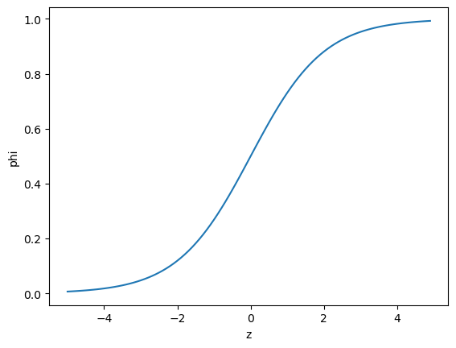

# 다양한 분류 알고리즘
- 럭키백의 확률 계산

<br>

[01] 로지스틱 회귀
---
### 01. 럭키백의 확률
- 럭키백에 들어갈 생선의 크기, 무게 등이 주어졌을 때 7개 생선에 대한 확률 출력

    - 길이, 높이, 두께, 대각선 길이, 무게 사용 가능

- k-최근접 이웃 분류기로 럭키백에 들어간 생선 확률 계산

    - 이웃의 클래스 비율을 확률이라고 출력

<br>

#### 01-1. 데이터 준비
> csv 파일을 데이터프레임으로 변환 후 출력
```python
import pandas as pd
fish = pd.read_csv('https://bit.ly/fish_csv_data')
fish.head()
```

> 결과

<div>
<style scoped>
    .dataframe tbody tr th:only-of-type {
        vertical-align: middle;
    }

    .dataframe tbody tr th {
        vertical-align: top;
    }

    .dataframe thead th {
        text-align: right;
    }
</style>
<table border="1" class="dataframe">
  <thead>
    <tr style="text-align: right;">
      <th></th>
      <th>Species</th>
      <th>Weight</th>
      <th>Length</th>
      <th>Diagonal</th>
      <th>Height</th>
      <th>Width</th>
    </tr>
  </thead>
  <tbody>
    <tr>
      <th>0</th>
      <td>Bream</td>
      <td>242.0</td>
      <td>25.4</td>
      <td>30.0</td>
      <td>11.5200</td>
      <td>4.0200</td>
    </tr>
    <tr>
      <th>1</th>
      <td>Bream</td>
      <td>290.0</td>
      <td>26.3</td>
      <td>31.2</td>
      <td>12.4800</td>
      <td>4.3056</td>
    </tr>
    <tr>
      <th>2</th>
      <td>Bream</td>
      <td>340.0</td>
      <td>26.5</td>
      <td>31.1</td>
      <td>12.3778</td>
      <td>4.6961</td>
    </tr>
    <tr>
      <th>3</th>
      <td>Bream</td>
      <td>363.0</td>
      <td>29.0</td>
      <td>33.5</td>
      <td>12.7300</td>
      <td>4.4555</td>
    </tr>
    <tr>
      <th>4</th>
      <td>Bream</td>
      <td>430.0</td>
      <td>29.0</td>
      <td>34.0</td>
      <td>12.4440</td>
      <td>5.1340</td>
    </tr>
  </tbody>
</table>
</div>

- 가장 왼쪽의 숫자는 행 번호(판다스의 인덱스)

- 가장 위의 항목(Species, Weight, Length, Diagonal, Height, Width)는 열 제목

    - 판다스는 csv 파일의 첫 줄을 자동으로 인식해 열 제목으로 지정

<br>

#### 💡 데이터프레임(dataframe)
- 판다스에서 제공하는 2차원 표 형식의 주요 데이터 구조

- 넘파이 배열과 비슷하게 열과 행으로 이루어져 있음

- 통계와 그래프를 위한 메서드 제공

- 넘파이로 상호 변환이 쉽고 사이킷런과도 잘 호환됨

<br>


> 어떤 종류의 생선이 있는지 Species 열에서 고유한 값 추출
```python
print(pd.unique(fish['Species']))
```
- 판다스의 unique() 함수 사용

> 결과
```python
['Bream' 'Roach' 'Whitefish' 'Parkki' 'Perch' 'Pike' 'Smelt']
```

<br>

> 타깃 : Species 열 / 입력 데이터 : 나머지 5개 열
```python
fish_input = fish[['Weight', 'Length', 'Diagonal', 'Height', 'Width']].to_numpy()
print(fish_input[:5])

fish_target = fish['Species'].to_numpy()
print(fish_target[:5])
```
- 데이터프레임에서 열을 선택하는 방법 : 원하는 열을 리스트로 나열

    - 새로운 데이터 프레임 반환

- 반환된 내용을 to_numpy() 메서드로 넘파이 배열로 바꿔 fish_input 에 저장

> 결과
```python
[[242.      25.4     30.      11.52     4.02  ]
 [290.      26.3     31.2     12.48     4.3056]
 [340.      26.5     31.1     12.3778   4.6961]
 [363.      29.      33.5     12.73     4.4555]
 [430.      29.      34.      12.444    5.134 ]]
 ['Bream' 'Bream' 'Bream' 'Bream' 'Bream']
```
- fish 데이터프레임 출력값과 비교하여 5개 특성이 잘 저장되었는지 확인


<br>

> 훈련 세트와 테스트 세트 분리 후 전처리
```python
from sklearn.model_selection import train_test_split
train_input, test_input, train_target, test_target = train_test_split(fish_input, fish_target, random_state=42)

from sklearn.preprocessing import StandardScaler
ss = StandardScaler()
ss.fit(train_input)
train_scaled = ss.transform(train_input)
test_scaled = ss.transform(test_input)
```
- 훈련 세트와 테스트 세트의 타깃 데이터에도 7개의 생선 종류 존재

    - **다중 분류** : 타깃 데이터에 2개 이상의 클래스가 포함된 문제

<br>

#### 01-2. k-최근접 이웃 분류기의 확률 예측
> KNeighborsClassifier 클래스 객체 생성 후 훈련 세트로 모델 훈련
```python
from sklearn.neighbors import KNeighborsClassifier
kn = KNeighborsClassifier(n_neighbors=3)
kn.fit(train_scaled, train_target)
print(kn.score(train_scaled, train_target))
print(kn.score(test_scaled, test_target))
print(kn.classes_)
print(kn.predict(test_scaled[:5]))
```
- 훈련 방식

    - 이진 분류 : 양성/음성 클래스를 각각 1, 0으로 지정해 타깃 데이터 생성

    - 다중 분류 : 사이킷런에서 문자열로 된 타깃값 그대로 사용 가능

        - 타깃값을 숫자로 바꾸어 입력도 가능

        - 문자열로 전달시 순서가 자동으로 알파벳순으로 매겨짐

- KNeighborsClassifier 에서 정렬된 타깃값은 classes_ 속성에 저장되어 있음

- predict() : 타깃값으로 예측 출력

> 결과
```python
0.8907563025210085
0.85
['Bream' 'Parkki' 'Perch' 'Pike' 'Roach' 'Smelt' 'Whitefish']
['Perch' 'Smelt' 'Pike' 'Perch' 'Perch']
```
- (3) pd.unique(fish['Species']) 로 출력했던 순서와 다름

- (4) 테스트 세트에 있는 처음 5개 샘플의 타깃값 에측

<br>

> 클래스별 확률값 확인
```python
import numpy as np
proba = kn.predict_proba(test_scaled[:5])
print(np.round(proba, decimals=4))  # 소수점 넷째 자리까지 표기(다섯번째 자리에서 반올림)
```
- 사이킷런의 분류 모델은 predict_proba() 메서드로 클래스별 확률값 반환

- 넘파이 round() 함수 : 소수점 첫째 자리에서 반올림

    - decimals 매개변수로 유지할 소수점 아래 자릿수 지정 가능

> 결과
```python
[[0.     0.     1.     0.     0.     0.     0.    ]
 [0.     0.     0.     0.     0.     1.     0.    ]
 [0.     0.     0.     1.     0.     0.     0.    ]
 [0.     0.     0.6667 0.     0.3333 0.     0.    ]
 [0.     0.     0.6667 0.     0.3333 0.     0.    ]]
```
- predict_proba() 출력 순서 : classes_ 속성과 같음

    - 첫 번째 열 : Bream 에 대한 확률

    - 두 번째 열 : Parkki 에 대한 확률

<br>

> 네 번째 샘플의 최근접 이웃의 클래스 확인
```python
distances, indexes = kn.kneighbors(test_scaled[3:4])
print(train_target[indexes])
```
- kneighbors() 메서드의 입력은 2차원 배열이어야 함

    - 넘파이 배열의 슬라이싱 연산자 사용

        - 슬라이싱 연산자는 하나의 샘플만 선택해도 항상 2차원 배열

> 결과
```python
[['Roach' 'Perch' 'Perch']]
```
- 다섯 번째 클래스인 Roach 1개, 세 번째 클래스인 Perch 2개

    - Roach 에 대한 확률 : 1/3 = 0.3333

    - Perch 에 대한 확률 : 2/3 = 0.6667

    - predict_proba() 로 출력한 확률과 동일함

- 3개의 최근접 이웃 사용 ⇒ 가능한 확률 : 0/3, 1/3, 2/3, 3/3 ⇒ 부족한 결과


<br>

### 02. 로지스틱 회귀(logistic regression)
- 이름은 회귀지만 분류 모델

- 선형 회귀와 동일하게 선형 방정식 학습

- 사이킷런에는 로지스틱 회귀 모델인 LogisticRegression 클래스 존재

<br>

> 선형 방정식
```
z = a * (Weight) + b * (Length) + c * (Diagonal) + d * (Height) + e * (Width) + f
```
- a, b, c, d, e : 가중치 or 계수

- 특성은 늘어났지만 다중 회귀를 위한 선형 방정식과 같음

- z 는 어떤 값도 가능하지만 확률이 되려면 0~1(또는 0~100%) 사이 값이 되어야 함

<br>

- **시그모이드 함수**(sigmoid function)

    - 로지스틱 함수(logistic function) 이라고도 함

    - z가 아주 큰 음수일 때 0, 아주 큰 양수일 때 1이 되도록 바꾸는 방법

    - 선형 방정식의 출력 z의 음수를 사용해 자연 상수 e를 거듭제곱하고 1을 더한 값의 역수

        - z가 어떤 값이 되더라도 ∅ 는 0~1 사이의 범위를 벗어날 수 없음

            - 0~1 사이 값을 0~100% 확률로 해석 가능

<br>

|시그모이드 함수와 그래프|
|-|
||


<br>

> 시그모이드 함수 계산
```python
import numpy as np
import matplotlib.pyplot as plt
z = np.arange(-5, 5, 0.1)
phi = 1 / (1 + np.exp(-z))
plt.plot(z, phi)
plt.xlabel('z')
plt.ylabel('phi')
plt.show()
```
- -5 ~ 5 사이에 0.1 간격으로 배열 z 생성 후 z 위치마다 시그모이드 함수 계산

- np.exp() 함수 : 지수 함수 계산

> 결과



<br>

#### 02-1. 로지스틱 회귀로 이진 분류 수행
- 이진 분류일 경우 시그모이드 함수의 출력이 0.5 보다 크면 양성 클래스, 작으면 음성 클래스로 판단

    - 정확히 0.5 일 경우 라이브러리마다 다르지만, 사이킷런은 음성 클래스로 판단

<br>

> 도미(Bream)와 빙어(Smelt)만 골라 로지스틱 회귀 모델 훈련
```python
# 불리언 인덱싱을 이용하여 도미와 빙어 데이터 분리
bream_smelt_indexes = (train_target == 'Bream') | (train_target == 'Smelt')
train_bream_smelt = train_scaled[bream_smelt_indexes]
target_bream_smelt = train_target[bream_smelt_indexes]

# 로지스틱 회귀 모델 훈련
from sklearn.linear_model import LogisticRegression
lr = LogisticRegression()
lr.fit(train_bream_smelt, target_bream_smelt)

# train_bream_smelt 의 처음 5개 샘플 예측
print(lr.predict(train_bream_smelt[:5]), '\n')

# train_bream_smelt 의 처음 5개 샘플의 예측 확률
print(lr.predict_proba(train_bream_smelt[:5]), '\n')

# 음성 클래스(0), 양성 클래스(1) 확인
print(lr.classes_, '\n')

# 로지스틱 회귀가 학습한 계수
print(lr.coef_, lr.intercept_)
```
- 비교 연산자를 사용해 도미와 빙어의 행을 모두 True 로 설정

    - train_target == 'Bream' : train_target 배열에서 Bream 인 것은 True, 나머지는 False인 배열 반환

    - 도미와 빙어에 대한 비교 결과를 비트 OR 연산자(|)를 사용해 합치기

- 골라낸 배열을 사용해 train_scaeld, train_target 배열에 불리언 인덱싱 적용

- LogisticRegression 클래스는 선형 모델이므로 sklearn.linear_model 패키지 아래 존재

- predict_proba() : 예측 확률

> 결과
```python
['Bream' 'Smelt' 'Bream' 'Bream' 'Bream'] 

[[0.99760007 0.00239993]
 [0.02737325 0.97262675]
 [0.99486386 0.00513614]
 [0.98585047 0.01414953]
 [0.99767419 0.00232581]] 

['Bream' 'Smelt'] 

[[-0.40451732 -0.57582787 -0.66248158 -1.01329614 -0.73123131]] [-2.16172774]
```
- 두 번째 샘플 제외하고 모두 도미로 예측

- 샘플마다 2개의 예측 확률 출력

    - 첫 번째 열 : 음성 클래스(0)에 대한 확률

    - 두 번째 열 : 양성 클래스(1)에 대한 확률

    - 두 번째 샘플만 `음성 클래스 확률 < 양성 클래스 확률`

- 사이킷런은 타깃값을 알파벳순으로 정렬하여 사용

    - Bream : 음성 클래스, Smelt : 양성 클래스

<br>

> 위 로지스틱 회귀 모델이 학습한 방정식
```
z = -0.404 * (Weight) - 0.576 * (Length) - 0.663 * (Diagonal) - 1.013 * (Height) - 0.732 * (Width) - 2.161
```

<br>

> LogisticRegression 모델로 z 값 계산
```python
# train_bream_smelt 의 처음 5개의 샘플의 z 값
decisions = lr.decision_function(train_bream_smelt[:5])
print(decisions, '\n')

# decisions 배열의 값을 확률로 변환
from scipy.special import expit
print(expit(decisions))
```
- LogisticRegression 클래스는 decision_function() 메서드로 z 값 출력 가능

- z 값을 시그모이드 함수에 통과시키면 확률 확인 가능

    - 파이썬의 사이파이(scipy) 라이브러리에 시그모이드 함수 존재 : expit()

        - np.exp() 함수로 분수 계산 하는 것보다 편리하고 안전

> 결과
```python
[-6.02991358  3.57043428 -5.26630496 -4.24382314 -6.06135688] 

[0.00239993 0.97262675 0.00513614 0.01414953 0.00232581]
```
- 출력된 확률 값 = predict_proba() 메서드 출력의 두 번째 열의 값

    - decision_function() 메서드는 양성 클래스에 대한 z 값 반환

<br>

#### 💡 불리언 인덱싱(boolean indexing)
- 넘파이 배열은 True, False 값을 전달하여 행 선택 가능

> 
```python
char_arr = np.array(['A', 'B', 'C', 'D', 'E'])
print(char_arr[[True, False, True, False, False]])
```
- A에서 ㄸ까지 5개의 원소로 이루어진 배열에서 A와 C만 골라내려면?

    - 첫 번째, 세 번째 원소만 True, 나머지는 False 인 배열 전달

> 결과
```python
['A' 'C']
```

<br>

---

<br>

[02] 확률적 경사 하강법
---


